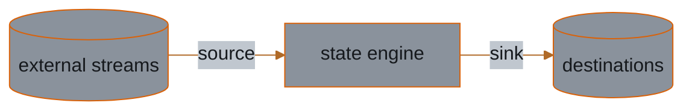
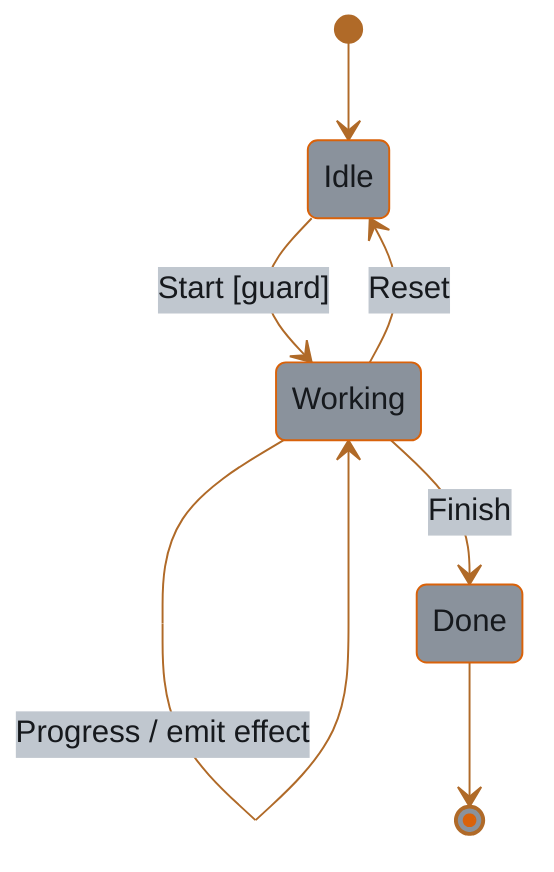
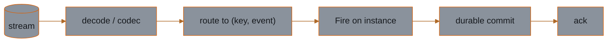
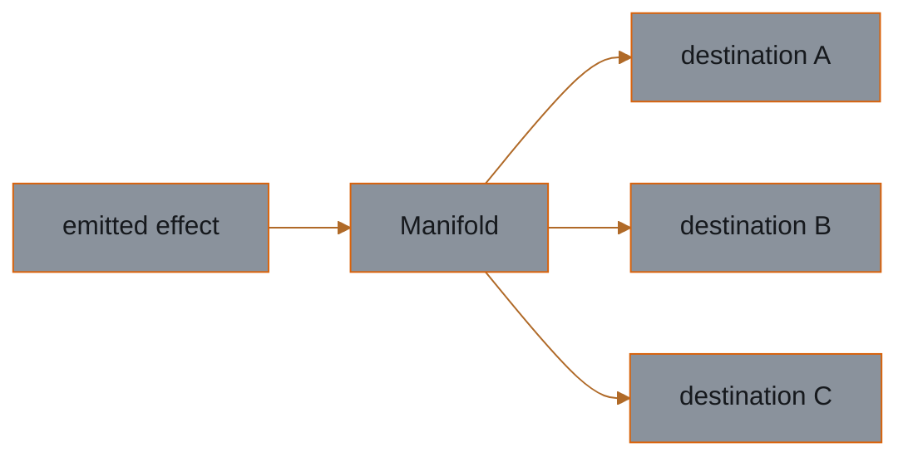

<h1 align="center">Crucible</h1>

<!-- Row 1: identity & quality -->

  
  
  
  

<!-- Row 2: project health & governance -->

  
  
  
  

  

<strong>Forge event-driven services in Go.</strong>

Crucible is a multi-module Go toolkit for building event-driven services. Its
design philosophy is **thin seams, no-op defaults, no forced dependencies**:
every cross-cutting concern (logging, tracing, metrics, IDs, time) is a small,
consumer-providable interface with a do-nothing default. You bring *your*
logger, *your* tracer, *your* clock. Crucible never makes you adopt its
choices, and never leaks a third-party type into a public signature.

The `state` engine is the extreme end of this: **stdlib-only**, with no injected
IO at all. The IO modules carry the heavier seams via injection, but follow the
same rule. Defaults are no-ops, nothing third-party is forced on the consumer.

## Documentation

Guides, concepts, the food-delivery example, and the generated API reference live
in the documentation site:

### **[stablekernel.github.io/crucible](https://stablekernel.github.io/crucible/)**

## Architecture

Three core modules form the **ingest → drive → emit** spine: `source` brings
events in, `state` decides what happens, and `sink` fans the resulting effects
out. Each is a thin seam you can adopt on its own, and none imports another.

<!--
  The docs site renders these diagrams via docs/src/mermaid-theme.mjs on its own
  dark background, so it can use the full dark brand palette. For the README on GitHub,
  viewers may be in light or dark mode, so the diagrams here use a dual-context variant:
  neutral steel fills (#8a929c) keep nodes legible on either background, while the same
  ember/copper accents (#d9620a, #c47a3d) preserve brand identity. The canonical brand
  hexes and the docs-site palette live in crucible.css and mermaid-theme.mjs.
-->

### `state` — the statechart engine

A stdlib-only statechart engine with no injected IO. Machines are pure: a `Fire`
folds an event into a new instance and emits effects as plain data, leaving
persistence and dispatch to the host.

### `source` — the ingress seam

Consumes external streams (Kafka, JetStream, Redis, CDC, and more) and drives a
machine, with the ack tied to a durable transition so redelivery is safe.

### `sink` — the egress seam

Fans emitted effects out to many destinations through a `Manifold`,
fire-and-forget; one outlet's failure never stops the rest.

## Modules

Each module is independently versioned (per-module SemVer) and carries its own
stability label.

| Module              | What it is                                                                | Status                   |
| ------------------- | ------------------------------------------------------------------------- | ------------------------ |
| `state`             | Domain-agnostic statechart engine. Stdlib-only, no IO.                    | v1.0.0 (stable)          |
| `state` subpackages | `analysis`, `evolution`, `conformance`, `verify`: diagnostics over the IR. | advisory                 |
| `state/expr`        | CEL-backed guards type-checked against the context schema.                | stable contract (v0.1.0) |
| `gen`               | Eject codegen: a machine's IR into typed Go stubs and registry wiring.    | v0.1.0                   |
| `cmd/crucible`      | Headless IR CLI: lint, render, diff, validate, eject.                     | v0.1.0                   |
| `telemetry`         | Vendor-neutral tracing/metrics seam, plus `slog`, `otel`, `datadog` adapters. | experimental             |
| `sink`              | Egress fan-out, fire-and-forget. 20+ destinations: SQL, Dynamo, S3, Kafka, NATS, Redis, StatsD, … | experimental             |
| `source`            | Ingress: consume streams and drive machines, ack on durable transition. Inlets: Kafka, JetStream, Redis, CloudEvents, CDC; opt-in retry/DLQ/idempotency/schema middleware. | experimental             |
| `durable`           | Durable-execution runtime: record and replay to survive a crash.         | experimental             |
| `cluster`           | Distribution runtime: remote actors, supervision, and live migration over a pluggable transport (in-memory transport tested; gRPC `transport` module behind the same interface). | experimental             |
| `wasm`              | Run state behaviors as WebAssembly: polyglot guards over a JSON ABI via wazero. | experimental             |
| `broker`            | Message broker seam: publish/subscribe transport with injected adapters.  | planned                  |

## Status

**`state` is released at v1.0.0 with a frozen public contract.** It is a
complete, embeddable statechart engine: hierarchical, parallel, and final states,
history, guard combinators, delayed transitions, invoked services, an actor
model, snapshots, and JSON (de)serialization.

- **`state` subpackages** (`analysis`, `evolution`, `conformance`, `verify`):
  advisory. They ship inside v1.0 but sit outside the frozen contract and may
  change in a minor release.
- **`state/expr`**: a separate module at v0.1.0. The module version is pre-1.0,
  but its expression *semantics* are a committed, stable contract.
- **`gen` and `cmd/crucible`**: released at v0.1.0, versioned independently of
  `state` and free to move at their own pace.
- **Everything else is experimental** and may change before it reaches v1:
  `telemetry`, `sink`, and `source` (with all adapters, codecs, and middleware),
  plus the host-side runtimes `durable`, `cluster`, `transport`, and `wasm`.
  `broker` is planned.

See **[STABILITY.md](STABILITY.md)** for what each label promises, and
**[CHANGELOG.md](CHANGELOG.md)** for the per-module release index.

## Roadmap

Two kinds of seam frame the work ahead, and both build on the engine without
reaching into the kernel: the IO edges where effects leave and events arrive, and
the serializable IR as a first-class artifact anything can read or write.

The kernel emits effects as pure data; a small family of bring-your-own-adapter
IO seams moves events to and from the outside world, each defaulting to a no-op
and forcing nothing third-party on the consumer:

- [ ] **`broker`** _(planned)_: pub/sub transport. Publish emitted events and
  subscribe machines to external streams.
- [x] **`sink`**: egress fan-out. Dispatch emitted effects to many outlets (SQL,
  Dynamo, StatsD, and more), fire-and-forget.
  [Docs](https://stablekernel.github.io/crucible/sink/overview/).
- [x] **`source`**: ingress. Subscribe external streams and drive machines, with
  the ack tied to a durable transition; the symmetric counterpart to `sink`.
  [Docs](https://stablekernel.github.io/crucible/source/overview/). The
  `source/cdc` codec decodes Debezium/OpenCDC change-event topics into typed
  change events; a native database write-ahead-log connector (logical replication
  slot, binlog) remains future work.

A small set of tools works the IR directly:

- [x] **IR CLI** (`cmd/crucible`): headless IR tooling for CI. Lint reachability and
  nondeterminism, render diagrams, diff and validate, and classify version diffs
  straight from a machine's serialized IR, no behavior bound.
- [x] **Eject codegen** (`gen`): turn a machine's IR into typed Go stub source. Each
  referenced behavior becomes a panic-bodied stub typed to the exact engine signature,
  plus a `Provide` function that wires them against the registry, so the host fills in
  bodies against a contract the compiler already checks.
- [ ] **Visual editor** _(planned)_: a browser workbench over the IR. Author, simulate,
  and inspect machines, with reachability and version-diff overlays from the existing
  `analysis` and `evolution` packages.

Durable state and event persistence is tracked separately with the `durable`
runtime, not here.

## Contributing

Contributions are welcome. See [CONTRIBUTING.md](./CONTRIBUTING.md) for dev
setup, the [Mage](https://magefile.org) targets, conventional commits, and the
DCO sign-off requirement. By participating you agree to the
[Code of Conduct](./CODE_OF_CONDUCT.md).

## License

Licensed under the [Apache License, Version 2.0](./LICENSE). See
[NOTICE](./NOTICE) for attribution.
