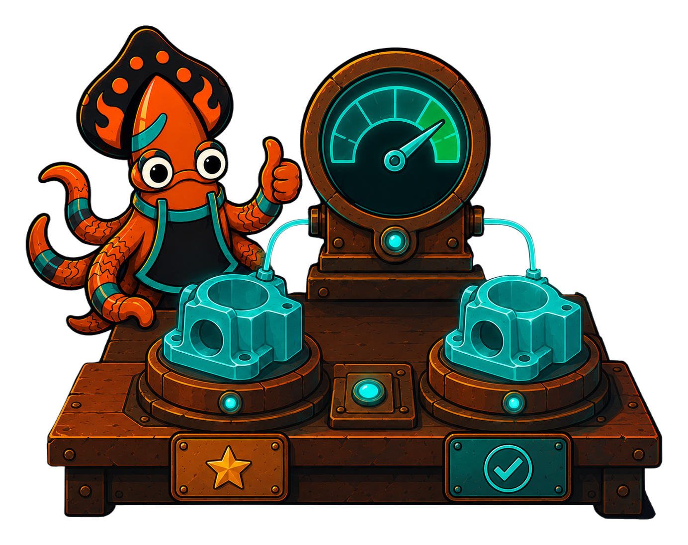

<!-- IMAGE-SLOT: conformance-replay. A foundry quality bench replaying a stamped golden casting against a fresh one, a glowing diff-meter reading "match", sky-squid signing off. 16:9 -->


Verification proves properties; **conformance** pins behavior. `state/conformance` replays recorded scenarios (ordered event sequences with assertions) against a machine and reports any divergence. It is the regression net: a golden test that fails the day a refactor changes what the machine *does*.

A scenario is serializable data (`conformance.Scenario`), so you can author it, commit it, and load it back with `LoadScenario`. Because events are typed in Go but named in the file, you bridge the two with an `EventCodec`.

```go
codec := conformance.EventCodec[Event]{
    Named:   func(e Event) string { return e.String() },
    Resolve: func(name string) (Event, bool) { e, ok := byName[name]; return e, ok },
}

res := conformance.RunAgainst(m, sc, newOrder(), codec, Open)
if !res.Passed() {
    t.Fatalf("scenario %q diverged: %+v", sc.Name, res)
}
```

`RunAgainst` casts a fresh instance, fires the scenario's events, and records a `Trace` (the portable, diffable record of states entered, effects emitted, and the final state), then evaluates the scenario's assertions.

To check that two machines agree, say a reference against a refactored subject, or a Go-authored machine against its JSON round-trip, `CompareMachines` runs a scenario set through both and reports field-level `Mismatch`es as an `*ErrConformance`:

```go
err := conformance.CompareMachines(reference, subject, scenarios, codec, Open, newOrder)
```

You don't have to hand-write the scenarios. `GenerateScenarios` walks the machine's structure to produce a set that reaches every state, and `verify.CoveringSuite` yields event sequences that exercise every transition. Either makes a strong starting corpus you then freeze as golden.

Conformance and verification cross-check each other: the suite that gives full [coverage](/crucible/analysis/verification/) is the suite worth freezing here.
