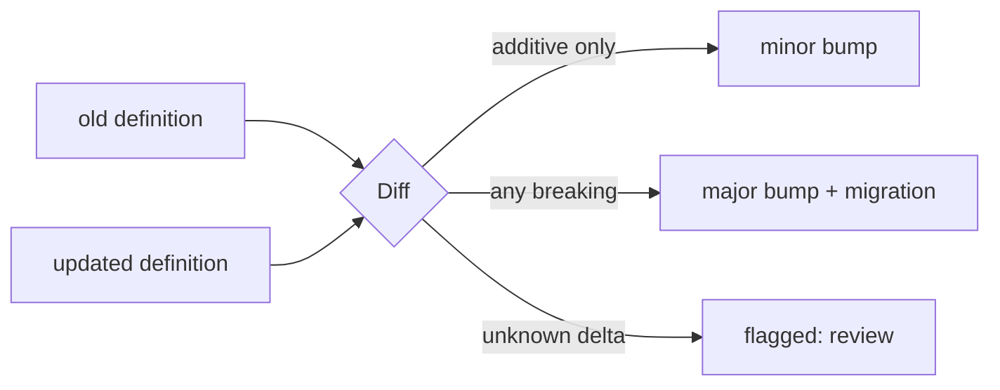

A machine definition is a contract. When you change it, you need to know whether the change is safe to roll out under the old version or whether it breaks existing instances. `state/evolution` answers that mechanically: diff two definitions, classify each delta, and recommend a SemVer bump.

```go
report := evolution.Diff(old, updated)
fmt.Printf("breaking=%v bump=%s\n", report.Breaking(), report.SemverBump())
// breaking=false bump=minor
```

`Diff` works on the IR; `DiffMachines` takes two frozen `*Machine`s, and `DiffJSON` takes two JSON definitions — same classification, whichever form you hold.

Each `Change` lands in a fixed bucket:

- **Additive** (backward-compatible, `minor`): a new state, a new transition, a guard added or removed, an effect added or removed, metadata or wait-mode changes.
- **Breaking** (`major`): a removed state or transition, a retargeted transition, a changed initial or final state, a renamed machine.
- **Unknown** → always treated as **breaking** and flagged for human review. The differ never silently waves through a delta it has no rule for.

`SemverBump()` rolls the whole report up to `Patch`, `Minor`, or `Major` — drop it straight into a release gate.



Evolution pairs with live migration: when a diff is breaking, the bump is your signal to run the deprecation lifecycle — stand up the new definition alongside the old, migrate in-flight instances, then retire the old one — rather than swapping it under running state.

<!-- IMAGE-SLOT: evolution-diff — two glowing statechart castings side by side with changed nodes haloed, a sky-squid foundry-stamp reading MINOR over the safe one and MAJOR over the breaking one — 16:9 -->

