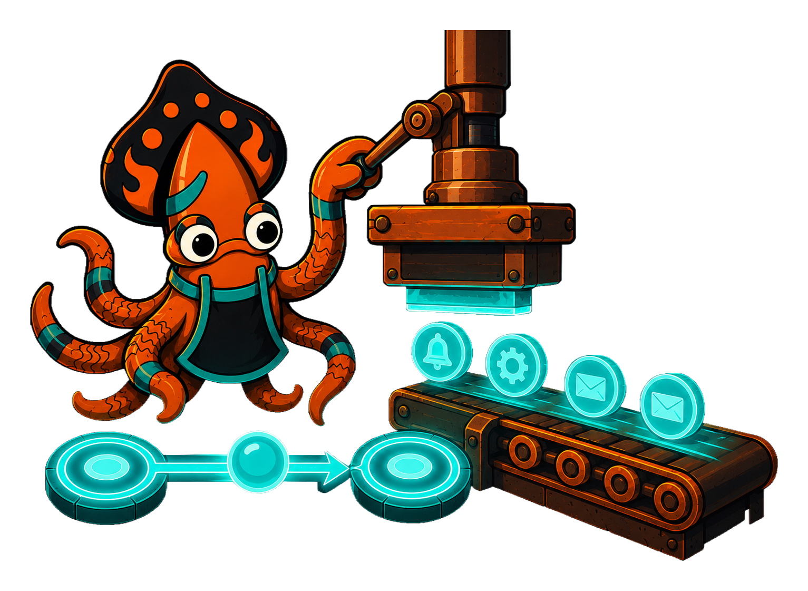
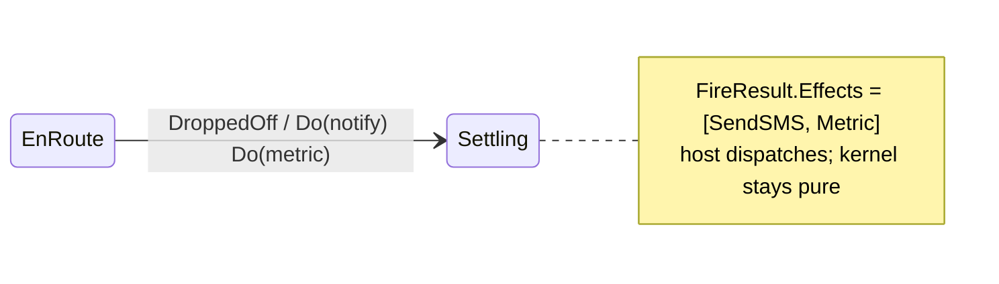

<!-- IMAGE-SLOT: effect-conveyor — sky-squid placing sealed effect parcels onto a conveyor belt labelled "host dispatches", kernel booth stays still — 16:9 -->


An **action** describes something the outside world should do: send an email, charge a card, emit a metric. Attach one with `Do`, naming an `ActionFn` registered on the machine. Multiple `Do` calls run **in declared order**:

```go
Transition(EnRoute).On(DroppedOff).
    Do("notifyCustomer").
    Do("emitDeliveredMetric").
    GoTo(Settling).Assign("recordDrop")
```

An action is a pure function from context to an effect value:

```go
type ActionFn[C any] func(ctx state.ActionCtx[C]) (state.Effect, error)

func notifyCustomer(ctx state.ActionCtx[Order]) (state.Effect, error) {
    return SendSMS{To: ctx.Entity.Phone, Body: "Delivered!"}, nil
}
```

The crucial discipline: **the kernel performs no IO**. An action returns an `Effect` — plain data — and the kernel collects every effect into the `FireResult`. Your host loop reads that slice and dispatches the real work. This keeps `Fire` deterministic and pure: the same context and event always yield the same effects, which is what makes the engine testable, replayable, and safe to run anywhere.



Contrast this with an **assign**. An assign rewrites the machine's own context (the next state of your data). An action emits a request for the world to change. A transition often does both — fold the new totals into context with `Assign`, and ask the host to notify the customer with `Do` — but they never blur: assigns mutate context, effects describe IO, and only the host acts on the latter.
