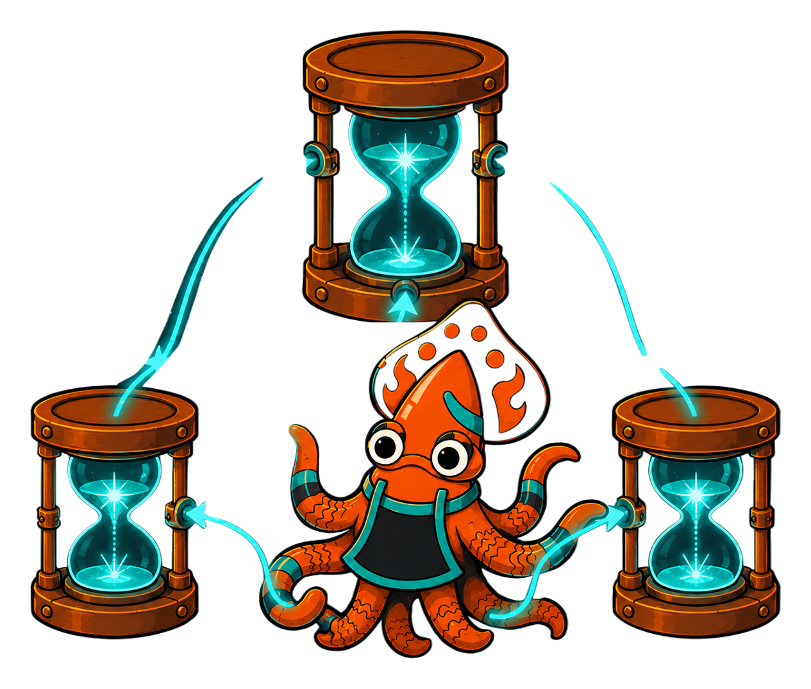
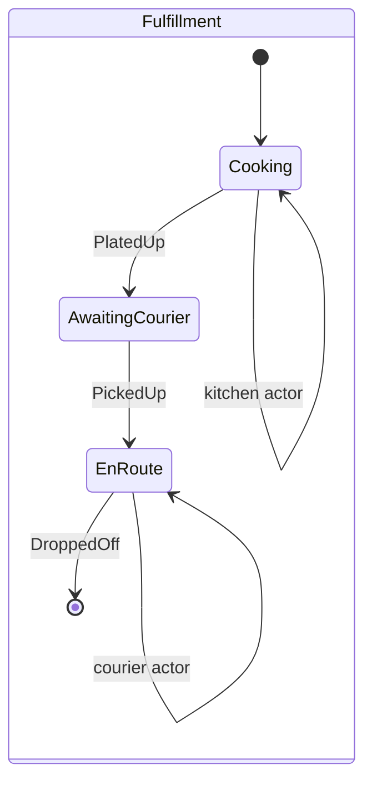

<!-- IMAGE-SLOT: actors-supervision-tree (a foundry overseer routing molten message-sparks between glowing child crucibles, parent above, kitchen and courier below) 16:9 -->


When a state needs to delegate work to a self-contained, concurrently-living unit, forge an **actor**: a child state machine the parent supervises through messages. Each actor has its own `(S, E, C)` types, runs independently, and reports back to the parent on completion.

An `ActorSystem` is the registry and supervisor. You bind a *behavior* (a factory that casts a fresh child instance) under a name, then a state invokes that name to spawn one.

```go
sys := state.NewActorSystem(orderInstance).
    Register("kitchen", kitchenBehavior()).
    Register("courier", courierBehavior())

// An ActorBehavior casts a fresh child per spawn and exposes its output.
func kitchenBehavior() state.ActorBehavior {
    return func(map[string]any) (state.ActorInstance, error) {
        inst := castKitchen()
        return state.NewActor(inst, func(i *state.Instance[kitchenStage, kitchenSignal, kitchenTicket]) any {
            return i.Entity().PlatedItem
        }), nil
    }
}
```

A state declares an actor invocation with `InvokeActor`, naming the signals fired when the actor completes or fails:

```go
b.SubState(Cooking).InvokeActor("kitchen", state.WithInvokeOnDone(PlatedUp), state.WithInvokeOnError(Declined))
b.SubState(EnRoute).InvokeActor("courier", state.WithInvokeOnDone(DroppedOff), state.WithInvokeOnError(Declined))
```

On entering `Cooking`, the kernel emits a spawn effect; the `ActorSystem` builds the actor and the host drives it. Address a running actor with its derived id and deliver events to it:

```go
ref, _ := sys.Ref(state.ActorID("kitchen", Cooking, 0))
sys.Deliver(ctx, ref, kitchenCook)
```

When the child reaches its final state, the system fires the parent's completion signal (`PlatedUp`), threading the actor's output into the parent's reducer.



The kitchen and courier are real child machines. The parent never reaches inside them. It spawns, messages, and folds their output. That isolation is what keeps a large workflow composable.
