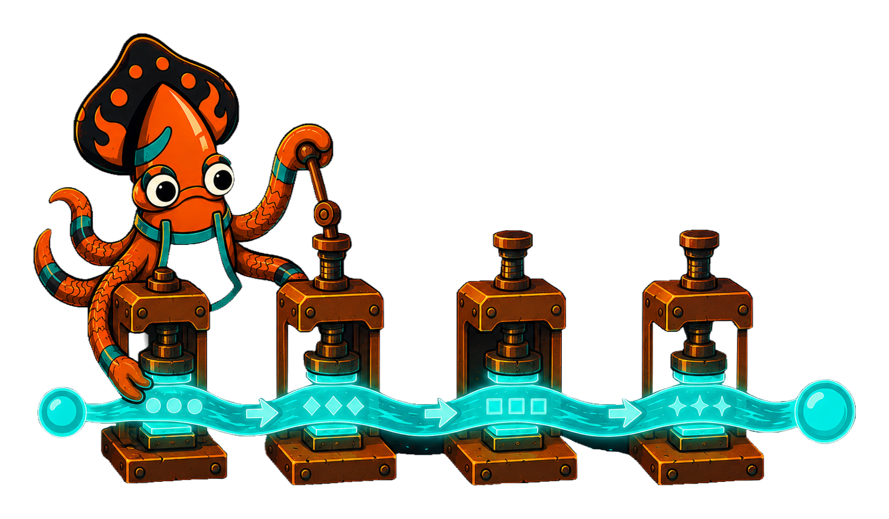
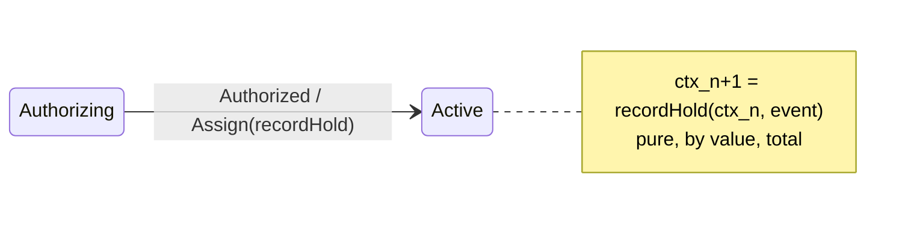

<!-- IMAGE-SLOT: reducer-fold — sky-squid folding a ribbon of context through ordered stations, each stamping the next value — 3:2 -->


The context is your machine's data — the order total, the held amount, the breach flag. The **only** place it changes is an **assign**: a pure reducer that takes the current context and returns the *next* one. Crucible uses value semantics, so a reducer receives a copy and yields a new value rather than mutating in place.

```go
type AssignFn[C any] func(in state.AssignCtx[C]) C

func recordHold(in state.AssignCtx[Order]) Order {
    o := in.Entity        // a copy
    o.HeldAmount = o.Subtotal
    return o              // the next context
}
```

Register reducers by name, then reference them on a transition. Multiple `Assign` calls **fold in declared order**, each receiving the output of the previous:

```go
reg.Assign("recordHold", recordHold)
reg.Assign("markBreached", markBreached)

// builder form is equivalent:
b.Reducer("settle", settleReducer)

Transition(Authorizing).On(Authorized).
    GoTo(Active).
    Assign("recordHold")
```

The `AssignCtx` carries the prior `Entity`, the triggering `Event`, and the ref's static `Params`, so a reducer can fold event payloads into context (for example, folding a saga's refunded amount in via the `onDone` event).



Keep assigns and actions distinct. An **assign** changes the machine's own context. An **action** (`Do`) emits an effect for the host to perform IO. A reducer must stay total and side-effect free — no IO, no errors, no clock reads — because the engine may replay it during recovery or analysis. If you need the outside world to react, return an effect from a `Do`; if you need the data to advance, fold it in an `Assign`.
