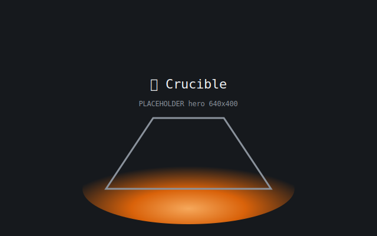
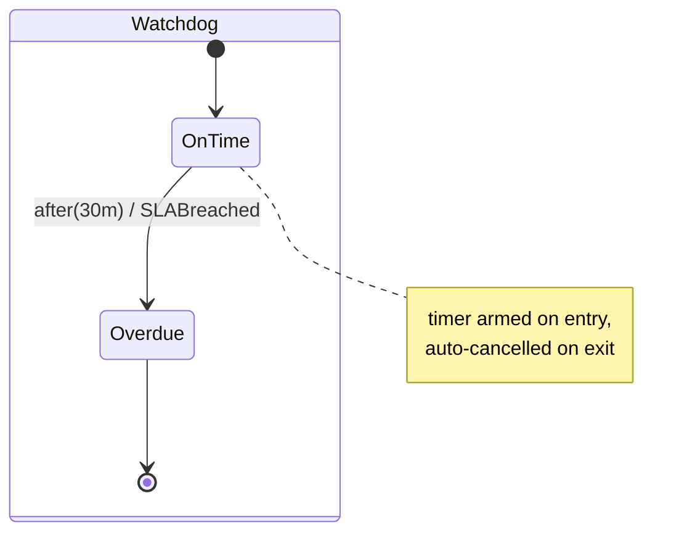

A **delayed transition** fires after a state has been active for a fixed duration — an SLA clock, a retry backoff, a session timeout. You declare it with `After(d)`: on entering the source state the kernel emits a `ScheduleAfter` effect; if the state exits before the delay elapses, the kernel emits a cancel effect (auto-cancel-on-exit).

The kernel never sleeps. The **host owns the timer**, driven by a `Scheduler` over an injected clock seam — so time is fully deterministic in tests and real in production.

```go
// In the Watchdog region: 30 minutes after OnTime is entered,
// the SLABreached edge fires and lands in Overdue.
b.Region("Watchdog").
    SubState(OnTime).
    After(30 * time.Minute).On(SLABreached).GoTo(Overdue).Assign("markBreached").
    SubState(Overdue).Final().
    EndRegion()
```

Wire a `FakeClock` and a `Scheduler`, then advance the clock to fire the edge deterministically:

```go
clk := state.NewFakeClock(time.Unix(0, 0).UTC())
sch := state.NewScheduler(inst)

clk.Advance(30 * time.Minute) // push past the SLA window
for _, fr := range sch.Tick(ctx) {
    absorb(ctx, fr.Effects) // SLABreached fired; effects flow back through Fire
}
```

In production you swap the `FakeClock` for the system clock — the same `After` declaration, the same `Scheduler.Tick`, no `time.Sleep` anywhere in the kernel.

<!-- IMAGE-SLOT: delayed-timer — a foundry hourglass wired to a molten-edge switch, sand draining toward an SLA-breach spark — 16:9 -->




Because the host re-feeds the delayed event through `Fire`, a delayed transition is just an ordinary transition with a clock-driven trigger — guards, reducers, and parallel regions all behave exactly as they do for any event.
