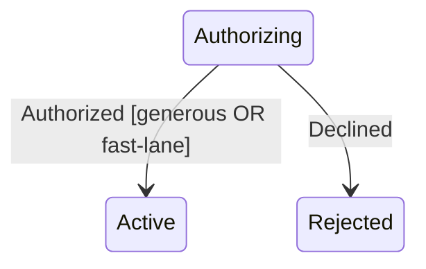

A guard is a condition that must hold for a transition to fire. Crucible offers two complementary styles, and both must pass when present.

**Named guards** reference a function registered by name; the params curry one generic guard into many specific ones. Chain multiple `When` calls and they are **AND**-ed together:

```go
Transition(Authorizing).On(Authorized).
    When("minSubtotal", map[string]any{"floor": 1500}).
    When("inServiceArea").
    GoTo(Active).Assign("recordHold")
```

**Expression guards** build a boolean tree from declarative nodes — no Go callback required, so they serialize cleanly. Combine `state.And`, `state.Or`, and `state.Not` with field predicates and `state.StateIn`:

```go
generous := state.Field[Stage]("subtotal").Ge(state.Int[Stage](5000))

Transition(Authorizing).On(Authorized).
    WhenExpr(state.Or(
        generous,
        state.And(
            state.Field[Stage]("subtotal").Ge(state.Int[Stage](2000)),
            state.Field[Stage]("priority").In(
                state.Str[Stage]("fast"), state.Str[Stage]("express"),
            ),
        ),
    )).
    GoTo(Active).Assign("recordHold")
```

Field predicates support `.Eq`, `.Ne`, `.Lt`, `.Le`, `.Gt`, `.Ge`, and `.In`, with operands built from `state.Str`, `state.Int`, `state.Float`, and `state.Bool`. `state.StateIn(s)` lets a guard depend on the active configuration. When a transition carries *both* `When` and `WhenExpr`, every named guard **and** the whole expression must evaluate true.



Guards are pure and side-effect free: they read context, they never mutate it. Keep the decision in the guard and the consequence in an assign or effect.

<!-- IMAGE-SLOT: gatekeeper — sky-squid as a luminous gatekeeper checking a glowing condition card before opening a transition arch — 3:2 -->


