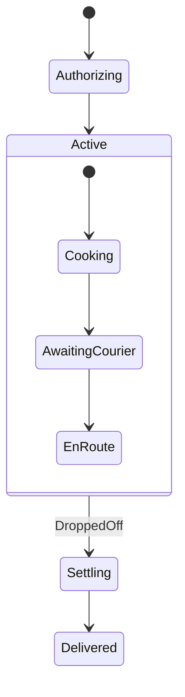
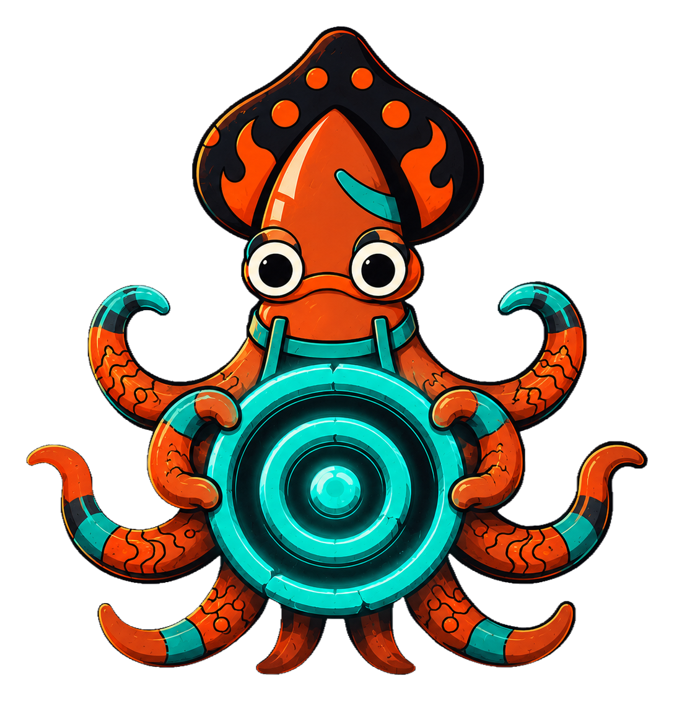

A flat machine forces every state to repeat the same escape hatches. A **super state** (a compound state) lets a cluster of substates share one parent, so a transition declared on the parent applies to every child below it. Declare a super state with `SuperState`, name its starting child with `Initial`, add children with `State`, then close the block with `EndSuperState`.

```go
m := state.Forge[Stage, Event, Order]("order").
    SuperState(Active).
    Initial(Cooking).
    State(Cooking).
    On(PlatedUp).GoTo(AwaitingCourier).Assign("recordPrep").
    State(AwaitingCourier).
    On(PickedUp).GoTo(EnRoute).
    State(EnRoute).
    // A transition on the super state itself fires from ANY child.
    Transition(Active).On(DroppedOff).GoTo(Settling).Assign("recordDrop").
    EndSuperState().
    Quench()
```

Entry and exit run **outermost-first on entry, innermost-first on exit**. Entering `Active` runs `Active`'s entry, then descends to its `Initial` child and runs that. The cross-cutting `DroppedOff` transition exits the deepest active child, then `Active`, then enters `Settling` — so cleanup composes naturally without duplicating it on each leaf.



The active configuration is always a *path*: `Active.EnRoute`, never just `EnRoute`. Events bubble up — a child handles them first, and an unhandled event rises to the parent. This is what lets the order's drop-off transition live once on `Active` and still fire while the kitchen is plating or the courier is riding.

<!-- IMAGE-SLOT: nested-rings — sky-squid cradling concentric glowing state rings, an inner child ring nested inside the Active super ring — 16:9 -->


