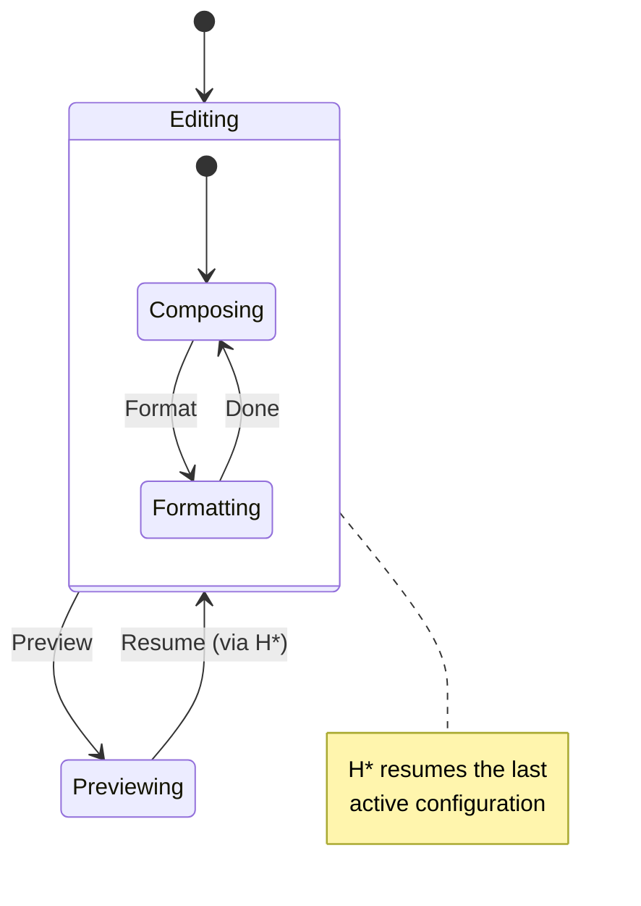

Sometimes leaving a compound state and coming back should *resume* where you were, not restart. A **history pseudo-state** records a compound's last active configuration so a transition targeting it re-enters that configuration instead of the compound's initial child.

Two flavors:

- **Shallow** (`HistoryShallow`) restores the compound's last active *direct* child.
- **Deep** (`HistoryDeep`) restores the full nested leaf configuration, all the way down.

Declare a history pseudo-state inside a `SuperState` block with `History`, and give it a `DefaultTo` fallback for the first entry — before any history exists:

```go
b.SuperState(Editing).
    History(EditingHistory, state.HistoryDeep).
    DefaultTo(Composing).
    SubState(Composing).On(Format).GoTo(Formatting).
    SubState(Formatting).On(Done).GoTo(Composing).
    EndSuperState()

// A transition that resumes the compound where it left off:
b.Transition(Previewing).On(Resume).GoTo(EditingHistory)
```

A history pseudo-state is structure, not a real child: it never counts toward the compound's substates and is never eligible as the initial state. The kernel resolves it at transition time — if the compound was last in `Formatting`, `Resume` lands you back in `Formatting`, not `Composing`.

<!-- IMAGE-SLOT: history-resume — a foundry ledger glowing with the last-cast configuration, an arrow looping a worker back to the exact mold they left — 16:9 -->




History is captured automatically on exit, so it survives snapshots too — restore re-arms exactly the configuration a `Resume` would have rejoined.
