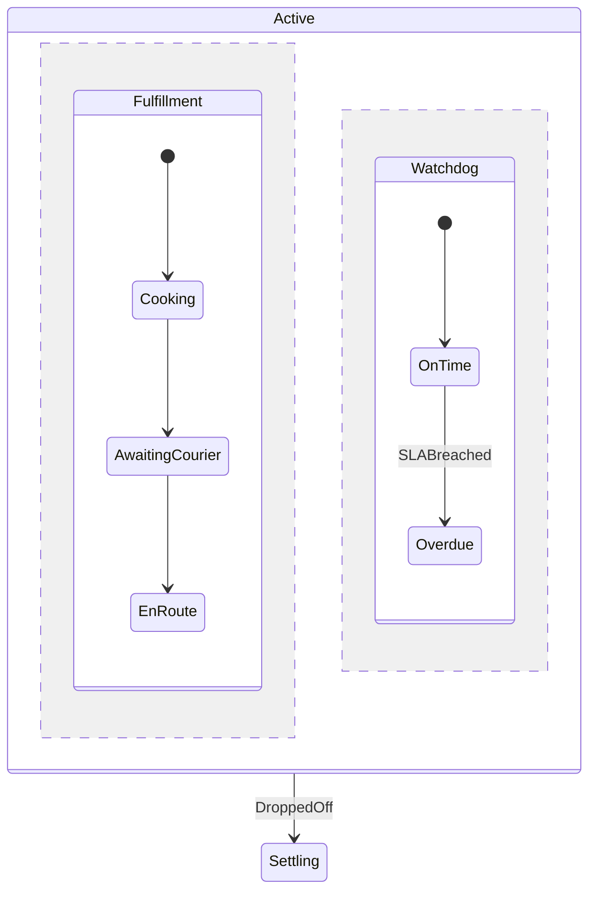

<!-- IMAGE-SLOT: orthogonal-lanes (sky-squid with two tentacles steering two parallel glowing lanes split by a dashed divider, kitchen lane and timer lane) 16:9 -->


Some concerns are genuinely independent: a kitchen prepping food while an SLA clock ticks. Modelling them as one flat sequence forces a false ordering. A **parallel super state** declares two or more orthogonal **regions** that are all active at once. Each region tracks its own leaf, and the machine's active configuration is the *union* of every region's current leaf.

Open each region with `Region`, give it an `Initial` child, and close it with `EndRegion`. In the food-delivery example, `Active` runs a **Fulfillment** region (kitchen then courier) alongside a **Watchdog** region (an SLA timer):

```go
SuperState(Active).
    Initial(Active).
    Region("Fulfillment").
    Initial(Cooking).
    State(Cooking).On(PlatedUp).GoTo(AwaitingCourier).Assign("recordPrep").
    State(AwaitingCourier).On(PickedUp).GoTo(EnRoute).
    State(EnRoute).
    EndRegion().
    Region("Watchdog").
    Initial(OnTime).
    State(OnTime).After(SLAWindow).On(SLABreached).GoTo(Overdue).Assign("markBreached").
    State(Overdue).
    EndRegion().
    Transition(Active).On(DroppedOff).GoTo(Settling).Assign("recordDrop").
EndSuperState()
```

Entering `Active` enters *both* regions' initials, so the configuration becomes `{Active.Fulfillment.Cooking, Active.Watchdog.OnTime}`. An event is broadcast to every region; each region that has a handler reacts independently. A transition on the parent (`DroppedOff`) exits all regions at once and leaves the whole parallel block.



The Watchdog is observational: it records a breach without blocking fulfillment, proving regions can advance at their own pace.
