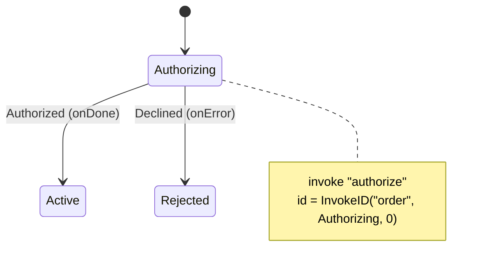

<!-- IMAGE-SLOT: invoked-service (sky-squid dispatching a glowing courier-orb to an external system, a return thread carrying the onDone signal home) 16:9 -->


A **service** is asynchronous work scoped to a state: authorize a payment, run a cancellation saga, call an external API. Unlike an effect (fire-and-forget data the host dispatches), a service has a lifecycle: it starts when the state is entered, and its completion feeds back into the machine as an event.

Declare an invocation with `Invoke`, naming the service and routing its outcomes with `WithInvokeOnDone` / `WithInvokeOnError`. The service is a context-aware function that may block and return a value or an error:

```go
type ServiceFn[C any] func(ctx context.Context, in state.ServiceCtx[C]) (any, error)

reg.Service("authorize", authorizeFn)

b.State(Authorizing).
    Invoke("authorize", state.WithInvokeOnDone(Authorized), state.WithInvokeOnError(Declined)).
    Transition(Authorizing).On(Authorized).GoTo(Active).Assign("recordHold").
    Transition(Authorizing).On(Declined).GoTo(Rejected).Assign("recordDecline")
```

When `authorizeFn` returns successfully, the runtime fires the `Authorized` (onDone) event; its return value rides along as the event payload, so an assign on that transition can fold the authorized amount into context. A non-nil error fires `Declined` (onError) instead. If the state exits before the service finishes, its `context.Context` is cancelled, so services must honor cancellation.



Each invocation has a stable identifier so the host can track and address it:

```go
id := state.InvokeID("order", Authorizing, 0)
```

The arguments are the machine name, the originating state, and the invocation's index on that state (zero-based, in case a state invokes several). That id is how you correlate a long-running call with the machine instance that launched it, and how the host knows which completion event to feed back.
