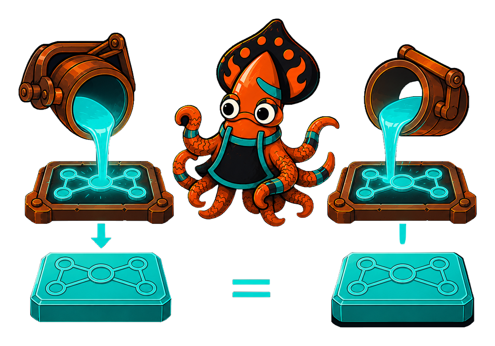
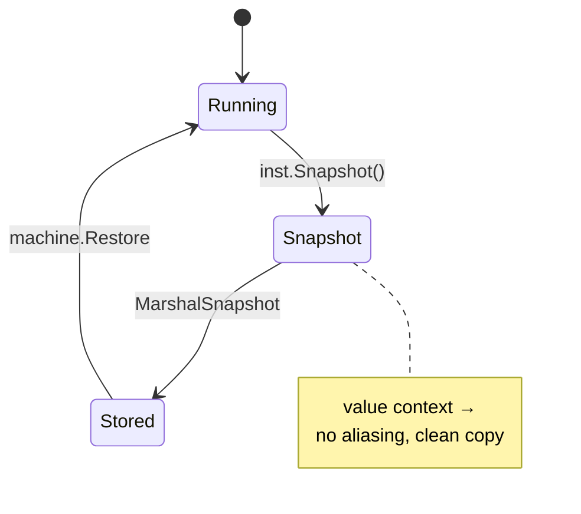

<!-- IMAGE-SLOT: snapshot-restore (a foundry pour freezing a glowing workpiece into a labeled ingot, then re-melting it into an identical mold) 16:9 -->


A long-lived workflow outlives the process running it. Crucible lets you **snapshot** a running instance to a clean, serializable value and **restore** it into a fresh machine: same configuration, same context, same pending work.

`Snapshot()` yields a typed `Snapshot[S, E, C]` carrying the active configuration, the bound context, history, and traces:

```go
snap := inst.Snapshot()

// Persist it as JSON...
raw, err := state.MarshalSnapshot(snap)
if err != nil {
    return fmt.Errorf("marshal snapshot: %w", err)
}

// ...and later restore into a freshly forged machine.
restored, err := machine.Restore(snap)
if err != nil {
    return fmt.Errorf("restore: %w", err)
}
```

The snapshot is **clean by construction** because context is a *value*, not a shared pointer graph: capturing `Snapshot()` copies the entity `C`, so the snapshot can never alias live state or mutate later. `Restore` rejects a snapshot whose `Machine` name does not match the target, so you never resume against the wrong definition.

Inspection accessors read the live instance without firing anything:

```go
inst.Current()       // primary active leaf; "what state am I in?"
inst.Configuration() // every active leaf (length N for N parallel regions)
inst.Entity()        // the bound context value
inst.History()       // the ordered Fire traces
```



A restored instance re-arms the configuration's effects, including pending `after` timers and in-flight actors, so it resumes exactly where it was captured, as a recovering host would after a process restart.
