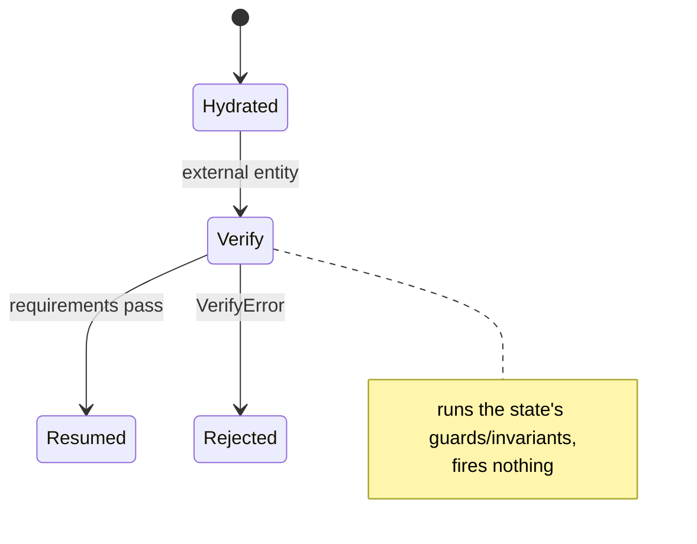

<!-- IMAGE-SLOT: verify-gate (a foundry inspector verifying an incoming ingot against a glowing requirement-template at the gate, rejecting a flawed casting) 16:9 -->


When an entity arrives from outside, whether loaded from a store, deserialized off the wire, or rebuilt by a foreign system, you cannot trust that it actually *belongs* in the state it claims. **`Verify`** is the trust-boundary check: it runs a state's declarative requirements (its guards and invariants) against an entity *without firing a transition*, answering "is this entity legally in this state?"

```go
order := loadFromStore(id) // hydrated externally; claims to be Cooking

if err := machine.Verify(Cooking, order); err != nil {
    return fmt.Errorf("order %s is not legally in Cooking: %w", id, err)
}
// Safe to resume from here.
```

By default `Verify` is **fail-fast**: it returns an `*VerifyError` carrying the first requirement that failed. To collect *every* violation in one pass, useful for reporting or validation UIs, pass `state.Aggregate()`:

```go
err := machine.Verify(Cooking, order, state.Aggregate())

var verifyErr *state.VerifyError
if errors.As(err, &verifyErr) {
    for _, f := range verifyErr.Failures {
        log.Printf("violation: %s: %s", f.Name, f.Reason)
    }
}
```

The error type is uniform across both modes; only how many failures it carries differs.



Use `Verify` wherever an entity crosses into your control before you resume driving it. It turns "I hope this object is valid" into a checked guarantee, without mutating the entity or advancing the machine.
