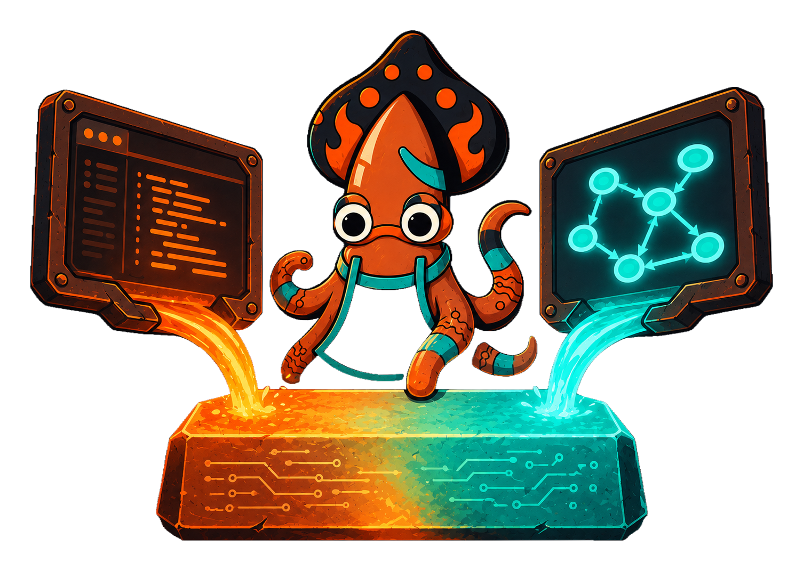

<!-- IMAGE-SLOT: two-front-ends-one-ir — a central glowing IR ingot (a JSON-etched metal bar) fed by two channels: on the left a code editor pouring molten Go, on the right a visual node-graph editor pouring molten diagram shapes; both crystallize into the same ingot, which then casts a running instance; foundry palette, sky-squid inspecting the ingot — 16:9 -->


The canonical form of a Crucible machine is not Go code — it is an **IR**: a pure
data structure describing states and transitions. The Forge DSL is one front-end
that *emits* this IR. A future visual editor would be another. Both produce the
same artifact.

## The config/implementation split

The IR is *configuration*: it describes structure and references behavior by
**name and params** through a `Ref` — it never embeds an executable function.
A transition might say "guard `generousOrder`" or "assign `applyDiscount` with
`{percent: 10}`", but the function itself lives elsewhere.

That elsewhere is the **registry**. The registry binds each name to a real Go
implementation:

```go
reg := state.NewRegistry[Order]().
    Guard("generousOrder", func(g state.GuardCtx[Order]) bool {
        return g.Entity.Subtotal >= 5000
    }).
    Assign("applyDiscount", func(a state.AssignCtx[Order]) Order {
        a.Entity.Discount = a.Params["percent"].(int)
        return a.Entity
    })
```

`Provide` binds a loaded IR to a registry, producing a builder you can `Quench`:

```go
ir, _ := state.LoadFromJSON[Status, Event, Order](data)
m := ir.Provide(reg).Quench()
```

When you author with the DSL directly, `Forge` carries its own registry — methods
like `.Guard`, `.Action`, and `.Reducer` register behavior into the same palette
the refs resolve against.

## Why the split matters

- **Lossless round-trip.** `ToJSON` and `LoadFromJSON` serialize and rebuild the
  IR without loss, so a machine can be stored, versioned, diffed, and shipped as
  data independent of the binary that runs it.
- **Dual authoring.** Code today, a visual editor tomorrow — the registry stays
  the single home for implementation, so the editor never needs to generate Go.
- **Inspectable structure.** Static analysis, diagram rendering, and verification
  all operate on the IR alone, never on opaque closures.
