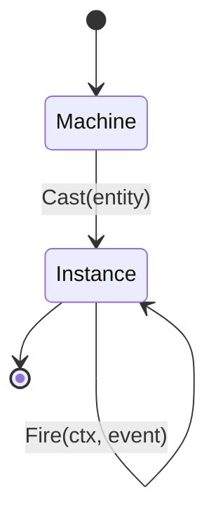

`crucible/state` draws a hard line between a machine's **definition** and its
**execution**. Understanding that line is the key to everything else.

## Machine: the frozen definition

A `*Machine[S, E, C]` is the immutable result of `Quench`. It holds the states,
transitions, and name-bound behavior — but no per-entity data and no mutable
state. Because it is immutable, a single `*Machine` is safe to share across
goroutines and reuse for the lifetime of your process. You forge and quench it
once:

```go
m := state.Forge[Gate, Signal, Turnstile]("turnstile").
    Initial(Locked).
    Transition(Locked).On(Coin).GoTo(Unlocked).
    Quench() // *Machine — immutable, share freely
```

## Instance: the running entity

A `*Instance[S, E, C]` is one entity advancing through that machine. You create
it with `Cast`, seeding it with your context value:

```go
inst := m.Cast(Turnstile{Coins: 0})
```

`Cast` is cheap — create as many instances as you have entities. Each carries
its own current state and context; none of them mutate the shared `*Machine`.

## The cast/fire loop

The runtime loop is the same everywhere the machine runs:



Each `Fire` takes the current `(state, context)` and an event, computes the next
state, and returns a `FireResult` containing `NewState`, the `Effects` to
dispatch, a `Trace`, and any `Err`. The instance holds the new state; the caller
decides what to do with the effects. Because `Fire` is a pure computation over
the definition plus the instance's own data, the same `*Machine` behaves
identically in a unit test, an HTTP handler, and an event consumer.
