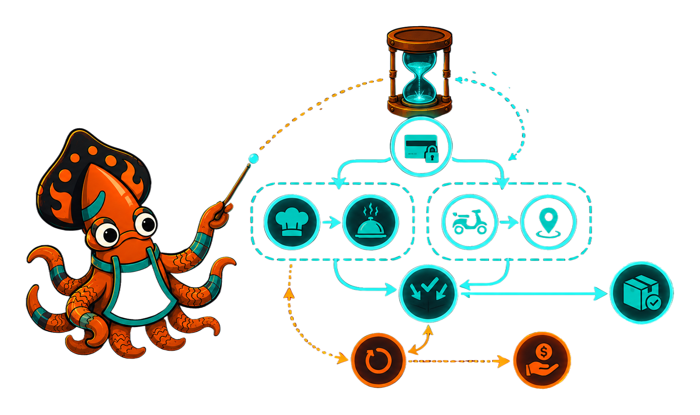

import Order from '../_generated/diagrams/_fooddelivery-order.md';

{/* IMAGE-SLOT: order-saga: sky-squid conducting a food-delivery order through a glowing statechart: payment hold, parallel kitchen and courier lanes under a draining SLA timer, branching to delivered or a refund compensation arc; 16:9 */}


Crucible's flagship example is a **food-delivery order saga**, `examples/fooddelivery`:
a generic ordering lifecycle invented from scratch, coupled to no real product.
It is a single statechart that exercises the whole engine the way a real service
would: hierarchy, parallel regions, guards authored as data, actors, invoked
services with compensation, and timer-driven escalation.

The diagram below is generated at build time from the real `fooddelivery.NewModel()`
machine (the same machine the example's tests exercise), so it can never drift
from the code:

<Order/>

## The happy path

An order rests in **Placed**. A `Submit` signal moves it to **Authorizing**,
which [invokes a payment service](/crucible/authoring/services/) to hold funds.
The authorization's outcome routes through two edges: `Authorized` advances the
order, `Declined` sends it to the **Rejected** terminal.

The `Authorized` edge is no rubber stamp. Its [guard](/crucible/authoring/guards/)
is an expression mixing tiers: a Core compare and membership test (`subtotal >=
threshold` *and* a fast-lane `priority`) OR a Rich CEL guard (`subtotal + tip >=
6000`), so a generous order *or* a flagged big basket is admitted.

## Active: two lanes at once

Admitted orders enter **Active**, an orthogonal [superstate](/crucible/authoring/hierarchical-states/)
running two [parallel regions](/crucible/authoring/parallel-regions/) at once:

- **Fulfillment** is the work spine: `Cooking` supervises a kitchen
  [actor](/crucible/authoring/actors/), whose plated output advances to
  `AwaitingCourier`, then `EnRoute` supervises a courier actor.
- **Watchdog** is an SLA clock. An [`after(30m)` delayed transition](/crucible/authoring/delayed-transitions/)
  fires `SLABreached` if the delivery window elapses, recording the breach in
  the order's context without blocking delivery.

Each region's actor messages the order on completion; an [assign reducer](/crucible/authoring/assigns/),
the order's *only* context writer, folds the result in.

## Exits: deliver, settle, compensate

The courier's `DroppedOff` is a cross-cutting transition on the **Active**
compound: it exits the whole parallel configuration to **Settling**, which
captures the held payment and runs to the **Delivered** terminal.

Cancellation is a saga. `Cancel` on **Active** exits to **Refunding**, which
invokes a refund service to reverse the authorization hold, the compensating
action, before reaching the **Canceled** terminal.

```go
m, err := fooddelivery.NewModel()
```

Notably, `NewModel` forges the machine, then round-trips it through its IR
(`ToJSON` → [`LoadFromJSON`](/crucible/serialization/json-ir/) → `Provide`) so
the CEL guard binds exactly as a host loading a serialized definition would:
the in-repo proof of the [serialization split](/crucible/serialization/overview/).
It can also [snapshot and restore](/crucible/authoring/snapshots-and-inspection/)
across a process restart mid-order.

## The same machine, under the full runtime

This page shows the *model*. The companion `examples/dispatch` showcase runs the
identical machine under the full runtime (**durable**, **distributed**,
**polyglot**, and **observed**) so the same statechart that renders this diagram
also survives restarts, fans out across processes, binds non-Go behavior, and
emits telemetry. See [integrating](/crucible/integrating/overview/) for the
runtime surface.
