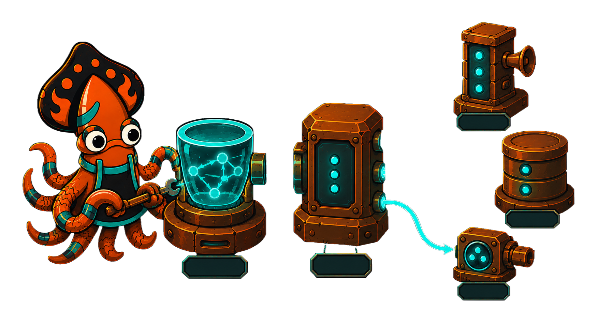
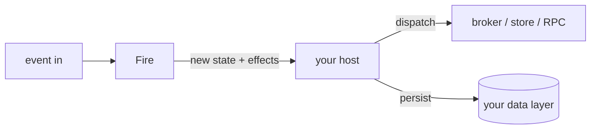

<!-- IMAGE-SLOT: decision-core-seam: a glowing crucible decision-core at center emitting effect-sparks across a clean seam to a host that routes them to broker, store, and RPC; sky-squid working the seam; 16:9 -->

Crucible is built to drop into a service you already have, not to take it over. The kernel is a **pure decision core**: you `Fire` an event, it returns the next state plus effects-as-data, and it performs no IO. Your host owns everything that touches the outside world.

That split is the integration story in one line. The kernel decides; the host acts.

Three properties make this comfortable inside an existing codebase:

- **The kernel imports only the standard library.** No transport, no broker, no logging vendor pulled into your dependency graph. A tiny dependency surface is a tiny blast radius.
- **Effects are data the host applies.** The kernel emits discriminated, serializable effects and never executes them. You decide whether an effect becomes a Kafka publish, a row write, or an RPC, and you do it at *your* boundary, inside *your* transaction.
- **One machine across test, HTTP, and consumer.** The same definition that a unit test exercises also runs behind a synchronous request handler and an asynchronous event consumer, unchanged. The behavior is identical because the decision is identical; only the dispatch differs.

The most common adoption question is "my domain is a big mutable aggregate behind a relational store, so how does a value-semantic kernel fit that?" It fits cleanly, but the recipe matters. The next page, [pointer-heavy codebases](/crucible/integrating/pointer-heavy-codebases/), is the field guide: don't make the aggregate your context, project it.
