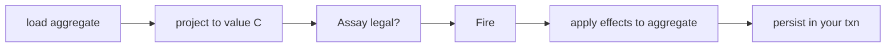
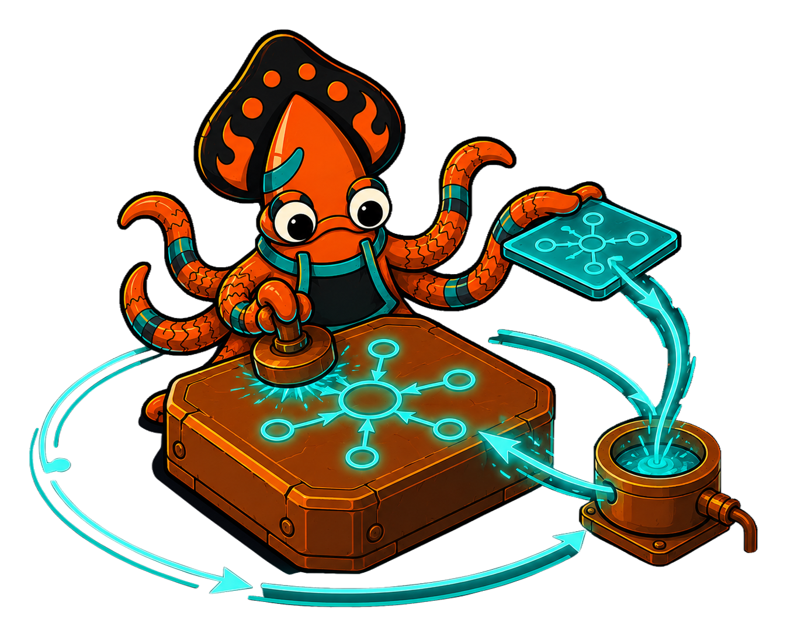

Most real services are built around a big mutable aggregate behind a relational store: a `*Order` with twenty fields, loaded by ID, mutated in place, saved in a transaction. Crucible's kernel wants a *value* context. The reconciliation is a single rule.

**Don't make the aggregate the context `C`.** Use a small **value projection** of the state-relevant fields as `C`. The machine decides transitions and emits effects over that projection; the host applies those effects to its real aggregate at the boundary, inside its existing transaction, using its existing mutation and persistence code.

```go
// Projection: only the fields the machine reasons about.
type OrderView struct {
    Total    int
    PaidCent int
    RushFlag bool
}

func (o *Order) project() OrderView {
    return OrderView{Total: o.Total(), PaidCent: o.Paid(), RushFlag: o.IsRush()}
}
```

### Why value semantics is load-bearing

A value `C` is not a stylistic preference — it is what makes the kernel's guarantees hold. Under a value context every step is a pure function of `(state, context, event)`, which is exactly what lets you **snapshot** an instance, **replay** it deterministically, persist it **durably**, and **verify** it statically (the entire [analysis & verification](/crucible/analysis/overview/) toolbox assumes it). `C = *T` is an available escape hatch, but choosing it forfeits all of that: a guard or action could mutate shared state under you, and snapshot/replay/verify stop meaning anything. Project a value; keep the guarantees.

### The boundary recipe

On the way in, when you hydrate an aggregate that *claims* to be in some state, use [`Assay`](/crucible/authoring/assay/) to check it is legally there before you resume driving it:

```go
order := repo.Load(ctx, id)              // hydrated externally
view := order.project()

if err := machine.Assay(order.State(), view); err != nil {
    return fmt.Errorf("order %s not legal in %s: %w", id, order.State(), err)
}
```

Then the round trip is always the same shape:

```go
inst := machine.Cast(view, state.WithInitialState(order.State()))
res := inst.Fire(ctx, event)             // pure decision over the projection

for _, eff := range res.Effects {        // []Effect — the data the host applies
    apply(order, eff)                    // YOUR mutation, on YOUR aggregate
}
order.SetState(res.NewState)
repo.Save(ctx, order)                    // YOUR persistence, YOUR transaction
```



**Before:** the machine reaches into the aggregate, mutates it, and persistence is tangled into transition logic. **After:** the machine touches nothing but a value snapshot, hands you effects, and your data layer stays the sole owner of mutation and IO.

<!-- IMAGE-SLOT: project-and-apply — a heavy pointer-aggregate ingot casting off a slim glowing value-projection wafer into the crucible, which returns effect-sparks the host stamps back onto the ingot inside a transaction ring — 16:9 -->


This recipe applies effects synchronously at the call site today. The event-driven IO seams let the host stop hand-wiring dispatch: [`crucible/sink`](/crucible/sink/overview/) fans effects out to many destinations fire-and-forget (and the [state-to-sink bridge](/crucible/sink/with-state/) makes "fan every transition out" a one-liner), while a `broker` for pub/sub transport is on the roadmap. The projection-and-apply boundary above is exactly the seam those plug into.
