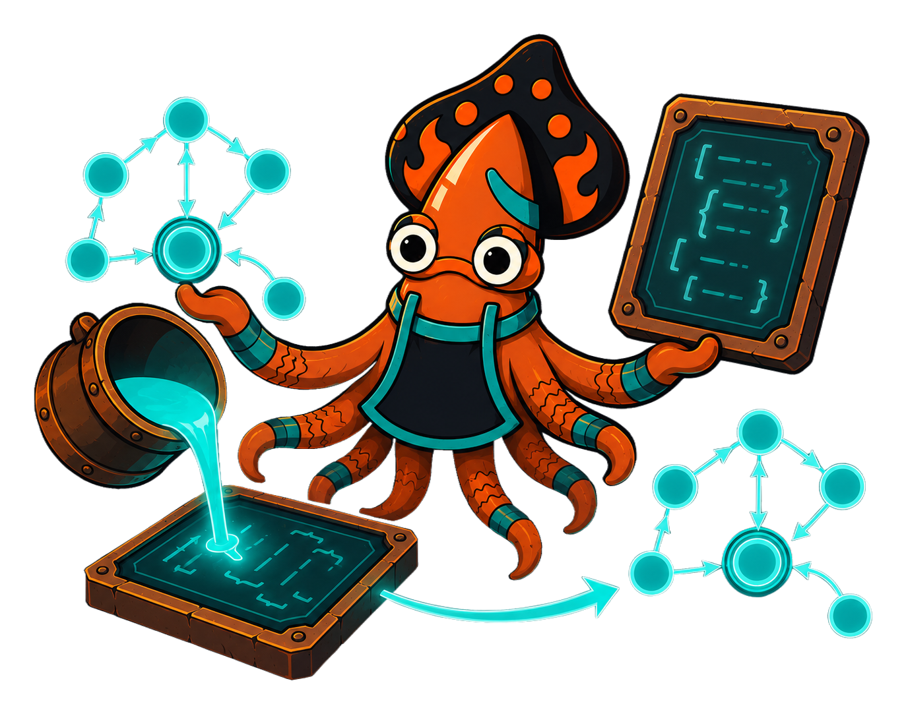

A Crucible machine has two faces. One is the running instance — guards firing,
reducers folding context, actors and services doing work. The other is the
machine's *definition*: the states, the transitions, the hierarchy, the named
hooks. That definition is the **IR**, and it is a first-class citizen — pure,
lossless data you can write to disk, ship over a wire, diff in a pull request,
or hand to a tool that never runs a single transition.

The split is deliberate. **Structure is data; behavior is a named reference.**
A transition's shape — its event, its target, its guard *expression* — lives in
the IR. The guard's *implementation* does not; the IR carries only its name. A
host registry binds those names back to Go functions when the machine is
re-quenched. So the IR round-trips through JSON without ever trying to serialize
a closure, and two machines — one forged in code, one loaded from JSON — are the
same machine.

<!-- IMAGE-SLOT: ir-interchange — a glowing statechart ingot being poured into a JSON mold and re-cast back into a running machine, sky-squid inspecting both forms as identical — 16:9 -->

This split unlocks the workflow Crucible is built around:

- **Persist** a definition and pin a durable instance to the exact version it
  derives from.
- **Interchange** machines between services, generators, and a future authoring
  UI, all reading and writing one canonical document.
- **Tool** over the structure — render diagrams, analyze reachability, verify
  invariants — without instantiating anything.

The next two pages cover the concrete surface: [JSON IR](/crucible/serialization/json-ir/)
for the round-trip, and [visualization](/crucible/serialization/visualization/)
for the diagrams forged from the same graph. For the conceptual backbone, see
[the IR and the split](/crucible/concepts/ir-and-the-split/).
