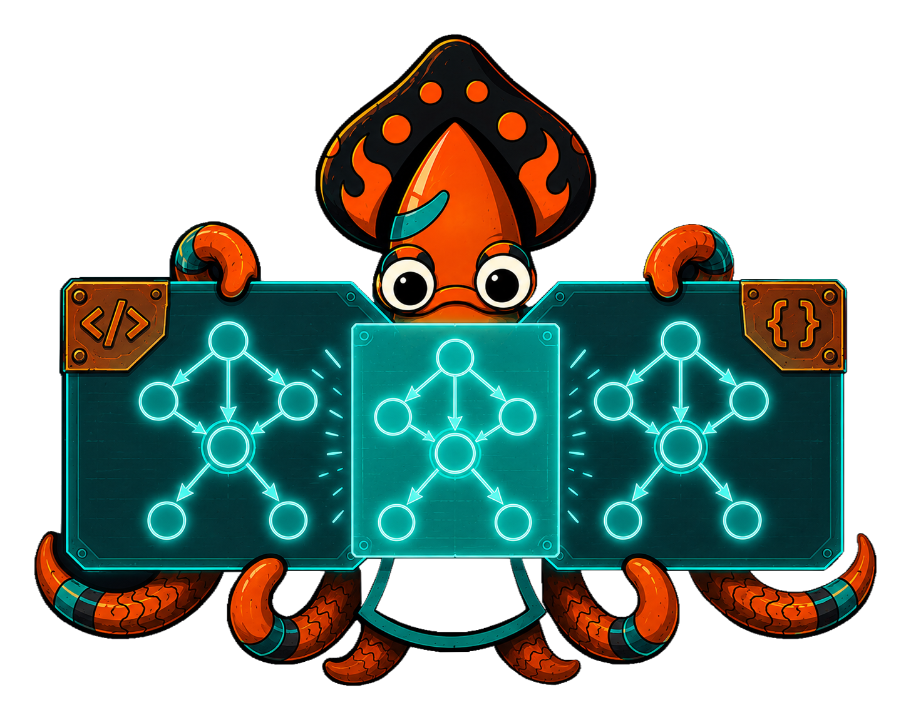

import Order from '../_generated/diagrams/_fooddelivery-order.md';

{/* IMAGE-SLOT: render-twins — sky-squid holding two identical glowing statechart prints, one forged from code and one from a JSON document, overlaid to reveal a perfect match — 16:9 */}


A definition you can read is a definition you can trust. Crucible renders any
machine to two diagram formats with one method call each.

## Two renderers

```go
mermaid := m.ToMermaid() // GitHub-renderable stateDiagram-v2
dot := m.ToDOT()          // GraphViz DOT, for richer SVG output
```

`ToMermaid` produces a `stateDiagram-v2` that renders inline on GitHub and in
docs. `ToDOT` emits GraphViz DOT — better for large, deeply hierarchical
machines where Mermaid grows unreadable, and for high-fidelity SVG on slides and
docs sites. Both are deterministic: states keep their declared order, edges are
sorted, so repeated calls are byte-identical and golden-stable.

Both renderers express the full structure: compound states nest, parallel
regions render with dividers (Mermaid) or dashed clusters (DOT), final states
draw their terminal marker, and owned states color-code by owner.

## Options

The same variadic options tune either format:

```go
m.ToMermaid(state.WithoutGuards())  // drop the [guard] suffixes
m.ToMermaid(state.WithoutOwners())  // drop owner color-coding
m.ToMermaid(state.LeftToRight())    // direction LR
m.ToDOT(state.TopToBottom())        // rankdir=TB
```

## Same graph, code or JSON

Rendering is a pure function of the machine graph — the very structure the IR
carries. A machine loaded with [`LoadFromJSON`](/crucible/serialization/json-ir/)
and re-quenched renders *identically* to one forged in code:

```go
ir, _ := state.LoadFromJSON[Stage, Signal, Order](b)
m := ir.Provide(reg).Quench()
fmt.Println(m.ToMermaid()) // same diagram, byte for byte
```

## A real diagram

The diagram below is generated at build time from `fooddelivery.NewModel()` via
`ToMermaid()` — the same machine the example's tests exercise, so it can never
drift from the code:

<Order/>

These renderers power this very docs site: every embedded statechart is forged
from a live machine, never hand-drawn. For the full lifecycle walkthrough behind
the diagram, see the [food-delivery example](/crucible/examples/overview/).
