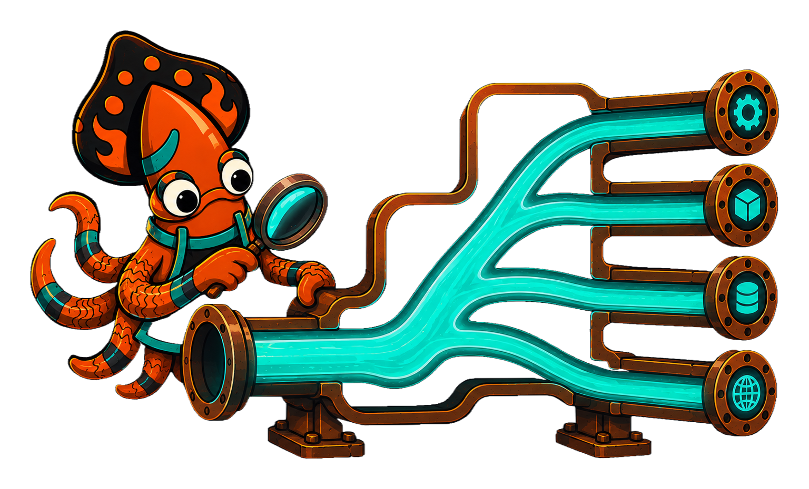
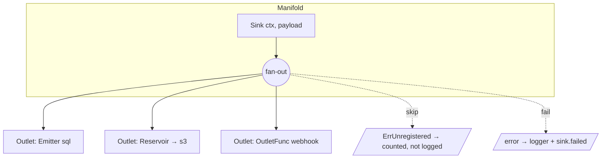

<!-- IMAGE-SLOT: sink-manifold-cutaway — a cutaway of a foundry manifold casting: one molten inlet channel branching into several outlet runners, each runner stamped with a destination glyph; sky-squid inspecting — 16:9 -->


Two types carry the whole model.

## Outlet — a single destination

An `Outlet` is one place a payload can go:

```go
type Outlet interface {
    Sink(ctx context.Context, payload any) error
}
```

`Sink` returns `ErrUnregistered` when the outlet has no handler for that
payload's concrete type — a normal, silent skip, not a failure. Any other error
is a real failure. The smallest possible outlet is a function:

```go
m.Attach(sink.OutletFunc(func(ctx context.Context, p any) error {
    return publish(ctx, p)
}))
```

An outlet may also implement optional capabilities, which the Manifold detects
by interface assertion and drives automatically — you never wire them by hand:

| Capability | Method | Driven by |
|---|---|---|
| `Flusher` | `Flush(ctx) error` | `Manifold.Flush` |
| `BatchOutlet` | `SinkBatch(ctx, []any) error` | `Reservoir` flushes |
| `Shutdowner` | `Shutdown(ctx) error` | `Manifold.Shutdown` |

## Manifold — one inlet, many outlets

A `Manifold` is the fan-out. Construct it with functional options, attach
outlets fluently, and emit:

```go
m := sink.NewManifold(
    sink.WithLogger(log),     // *slog.Logger; default discards
    sink.WithTracer(tracer),  // telemetry.Tracer; default no-op
    sink.WithMeter(meter),    // telemetry.Meter; default no-op
)
m.Attach(
    sqlOutlet,
    sink.Reservoir(s3Outlet, sink.WithBatchSize(100)),
)

m.Sink(ctx, OrderPlaced{ID: "A-1"}) // fan out to every outlet
```

Every seam has a no-op default, so a zero-option `NewManifold()` is fully
functional and completely silent: it logs to a discard handler and records to
no-op telemetry. You opt into observability by passing real seams, never by
satisfying a required dependency.



A `Manifold` is intentionally **not** itself an `Outlet`: its `Sink` is
fire-and-forget and returns nothing, while `Outlet.Sink` returns an error. To
nest one manifold inside another, bridge the two with an `OutletFunc`:

```go
parent.Attach(sink.OutletFunc(func(ctx context.Context, p any) error {
    child.Sink(ctx, p)
    return nil
}))
```

Most destinations are not hand-written outlets, though — they are
[`Emitter`s built from a typed client and a registry](/crucible/sink/destinations/).
The next page covers what happens to a payload once it enters the Manifold.
