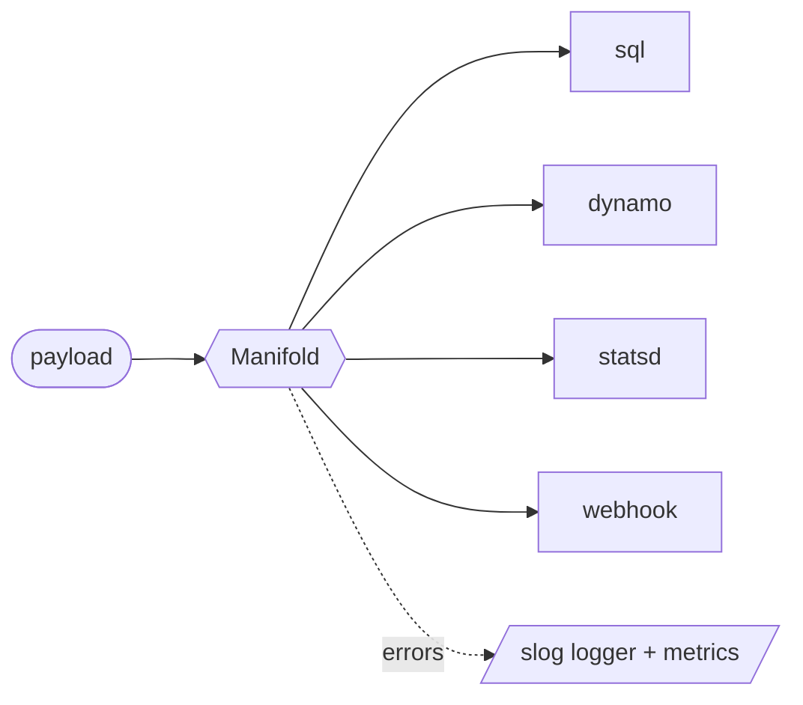
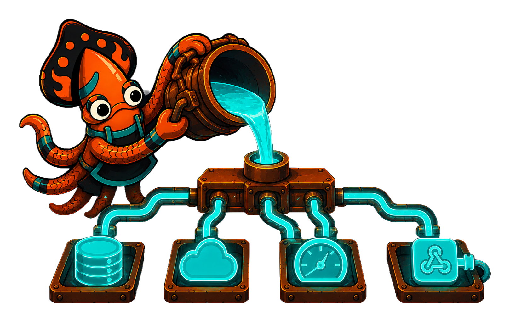

`crucible/sink` is the suite's **egress seam**: a fire-and-forget fan-out emitter.
A service calls one method —

```go
m.Sink(ctx, payload)
```

— and the payload fans out to every attached destination: a SQL table, a
DynamoDB item, a StatsD counter, a webhook, a log line. The call site never
names which destinations are wired; that wiring lives in one place, set up once,
and the emit path stays a single line forever.

Like every Crucible module, sink is built from **thin seams with no-op defaults
and no forced dependencies**. The core imports only the standard library and
[`crucible/telemetry`](/crucible/sink/telemetry/); every vendor SDK lives in its
own optional sub-module, so you pull in exactly the destinations you use and
nothing else.

## The shape of it

A [`Manifold`](/crucible/sink/model/) holds a set of [`Outlet`](/crucible/sink/model/)s
and dispatches each payload to all of them. `Manifold.Sink` is the only emit
path and it returns nothing — failures go to the configured logger and metrics,
not back up the call stack.



That is the whole idea: **one inlet, many outlets, fire and forget.** A caller
who genuinely needs confirmation for one critical destination holds that
`Outlet` directly and calls it for an honest per-destination error — but the
fan-out itself never blocks or surprises the call site.

## Where it fits in the suite

The [`state`](/crucible/start/introduction/) kernel decides *what* should happen
and emits [effects as pure data](/crucible/concepts/effects-and-purity/); it
performs no IO. sink is a natural place to send those effects: the host's
dispatch loop hands each effect to a `Manifold`, and the fan-out carries it to
the outside world. Neither module imports the other — they compose through the
optional [bridge](/crucible/sink/with-state/) when you want them together, and
stand completely alone when you do not.

sink is the first of a small family of bring-your-own-adapter **IO seams**
(`broker`, `source`, and friends are on the roadmap), each defaulting to a no-op
and forcing nothing third-party on the consumer.

<!-- IMAGE-SLOT: sink-overview-fanout — a sky-squid smith at a crucible pouring one molten stream that splits into several channels feeding labelled molds (sql, dynamo, statsd, webhook); ember/copper on steel — 16:9 -->


## Next

- [The Manifold and Outlet model](/crucible/sink/model/) — the vocabulary.
- [Fire-and-forget fan-out](/crucible/sink/fan-out/) — semantics, errors, batching.
- [Destinations](/crucible/sink/destinations/) — the sub-module catalog.
- [Telemetry wiring](/crucible/sink/telemetry/) and [graceful shutdown](/crucible/sink/shutdown/).
- [Fanning state transitions out](/crucible/sink/with-state/) — the optional `state` bridge.
