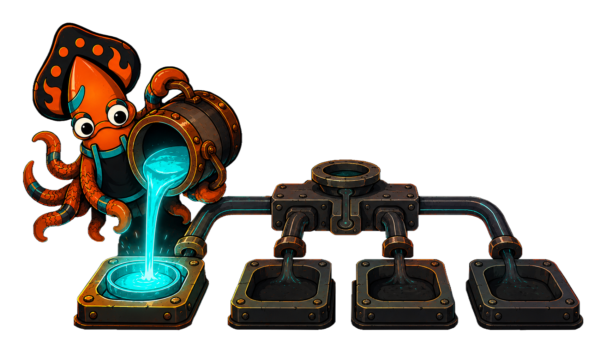

<!-- IMAGE-SLOT: sink-shutdown-drain — a foundry at end of shift: the sky-squid tipping the last measured pour out of a reservoir ladle before banking the fire, channels running clear; ember/copper cooling to steel — 16:9 -->


Buffered outlets hold payloads that have not yet reached their destination. On a
clean shutdown you want those drained, the background loops stopped, and any
held resources released — within a deadline.

The Manifold exposes three lifecycle methods:

```go
func (m *Manifold) Flush(ctx context.Context) error    // push buffered outlets out now
func (m *Manifold) Shutdown(ctx context.Context) error  // flush, then stop + drain
func (m *Manifold) Close() error                        // io.Closer → Shutdown(context.Background())
```

- **`Flush`** calls `Flush` on every attached `Flusher` (a `Reservoir`, the
  `statsd` aggregator) and joins their errors. Use it to force a release without
  tearing anything down — for example before reading back what landed in a test.
- **`Shutdown`** flushes first, then calls `Shutdown` on every `Shutdowner`,
  draining in-flight work within `ctx`'s deadline. Background loops stop and wait
  to exit (no goroutine leak); shutdown is idempotent.
- **`Close`** is the `io.Closer` convenience: `Shutdown` with a background
  context, for `defer`-friendly call sites.

A typical server wires it to its shutdown signal with a bounded deadline:

```go
m := sink.NewManifold(sink.WithMeter(meter)).Attach(
    sink.Reservoir(s3Outlet, sink.WithBatchInterval(5*time.Second)),
)
// ... serve ...

shutdownCtx, cancel := context.WithTimeout(context.Background(), 10*time.Second)
defer cancel()
if err := m.Shutdown(shutdownCtx); err != nil {
    log.Error("sink drain incomplete", "error", err)
}
```

A `Poller` is driven separately: `Stop` cancels its loop and waits for the
in-flight collection to finish.

```go
p := sink.NewPoller(target, collect).Start(ctx)
defer p.Stop()
```

Because draining is bounded by the context you pass, a wedged destination can
never hang your shutdown forever — it fails the deadline, the error is joined and
returned, and your process exits. Thin seams, predictable teardown.
