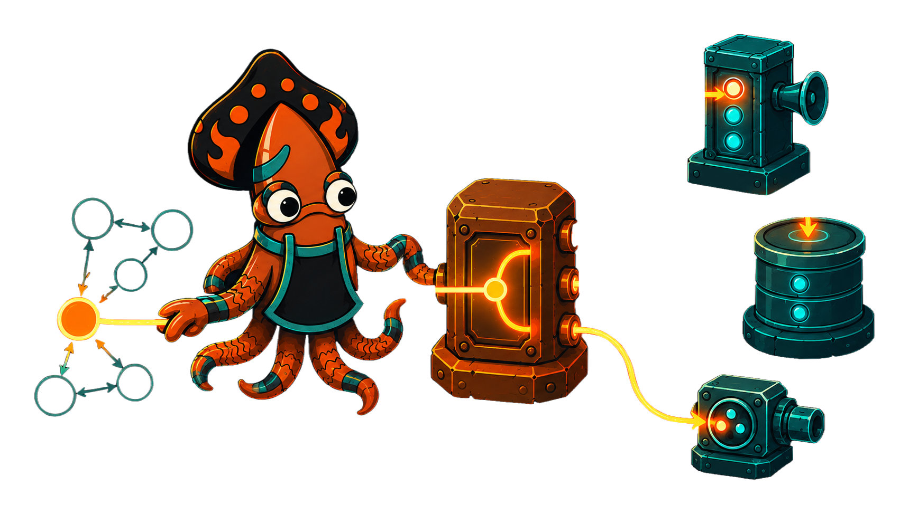
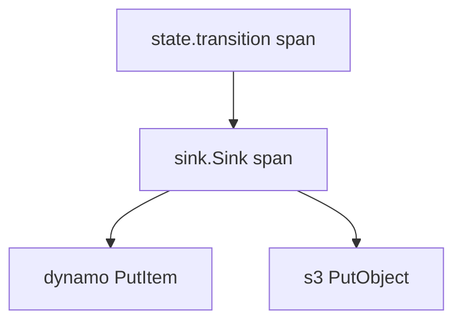

<!-- IMAGE-SLOT: sink-telemetry-thread: a single glowing thread (one trace) running from a state-transition spark, through the manifold's fan-out, down into each destination, all lit the same ember hue; sky-squid following the thread; 16:9 -->


sink **consumes** [`crucible/telemetry`](/crucible/reference/), the suite's
vendor-neutral tracing and metrics interface. It does not define its own
observability abstraction and it pulls in no telemetry vendor. You pass one
shared `Tracer` and `Meter`, the same ones the rest of your service (and the
[`state`](/crucible/start/introduction/) kernel) use, and sink records through
them.

```go
m := sink.NewManifold(
    sink.WithLogger(logger),  // *slog.Logger
    sink.WithTracer(tracer),  // telemetry.Tracer
    sink.WithMeter(meter),    // telemetry.Meter
)
```

Every seam defaults to a no-op: a discarding `slog` handler, `telemetry.NopTracer()`,
`telemetry.NopMeter()`. An un-instrumented Manifold allocates no backend and does
no IO on the hot path. Observability is opt-in, never a required dependency.

## What it records

| Instrument | Kind | Meaning |
|---|---|---|
| `sink.Sink` | span | one fan-out; attributes include the payload type |
| `sink.sunk` | counter | payloads an outlet accepted without error |
| `sink.failed` | counter | non-skip outlet failures (also logged + on the span) |
| `sink.skipped` | counter | outlets that skipped a payload as unregistered |
| `sink.dropped` | counter | payloads dropped at a Reservoir's buffer cap |
| `sink.batch_size` | histogram | payloads per Reservoir flush |
| `sink.flush_latency_ms` | histogram | Reservoir flush duration |

## Context propagation is the seam

`Manifold.Sink` starts the `sink.Sink` span on the context you pass and
propagates that context to every `Outlet.Sink`. So when the caller already holds
a span (a request span, or a [state transition span](/crucible/sink/with-state/)),
the emit span **nests underneath it**, and each outlet's own spans nest under
the emit. One trace tells the whole story: the transition that decided, the
fan-out that dispatched, and the writes that landed.



Because both modules speak the same `crucible/telemetry` interface, this works
with whatever backend you wire behind it (the telemetry module ships `slog`,
OpenTelemetry, and Datadog adapters), and sink never knows which one it is.
