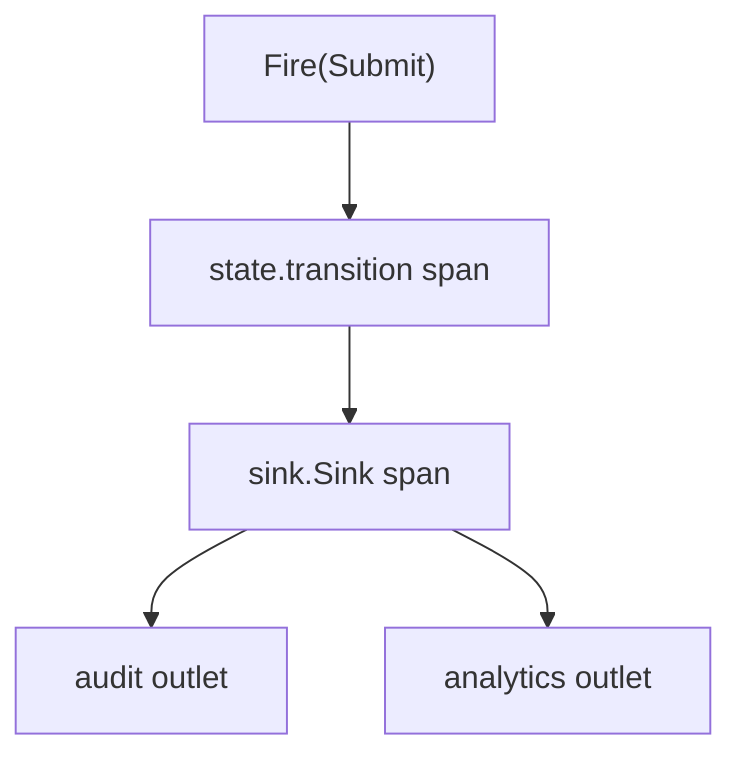
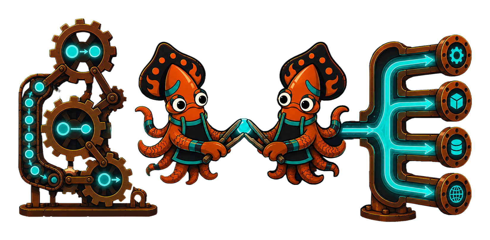

sink and [`crucible/state`](/crucible/start/introduction/) are designed to compose
**without either core importing the other**. The [`state`](/crucible/concepts/effects-and-purity/)
kernel emits effects as pure data and performs no IO; sink is a natural place to
dispatch them. The optional `crucible/sink/bridge` module is the seam that joins
them — pulled in only when you want them together, forcing nothing on a service
that uses just one.

## A transition fans out in one line

`bridge.Middleware` wraps a machine's `Fire` so every successful transition fans
out through a `Manifold`:

```go
m := sink.NewManifold(sink.WithTracer(tracer)).Attach(auditOutlet, analyticsOutlet)

machine := state.Forge[string, string, *Order]("order").
    Use(bridge.Middleware[string, string, *Order](m, bridge.WithTracer(tracer))).
    // ... states and transitions ...
    Quench(state.Strict())

machine.Cast(order).Fire(ctx, Submit) // the transition fans out through m
```

Each transition is delivered as a `bridge.Transition` value (machine, event,
from, to); register transformers for it on your destinations just like any other
payload.

## Spans nest, because Fire carries context

`Fire` carries a `context.Context`, so the middleware starts a `state.transition`
span and propagates its context into `Manifold.Sink`. With the **same tracer**
wired into both the machine and the Manifold, the `sink.Sink` span nests under
the transition span, and each outlet's write nests under that — the whole causal
chain in one trace.



This is the proof the two libraries compose cleanly: a state decision, its
fan-out, and the resulting writes all correlate through the shared
[`crucible/telemetry`](/crucible/sink/telemetry/) provider, with no import edge
between the kernels.

## Two seams, one for each need

- **`bridge.Middleware`** — the context-propagating path. Use it whenever trace
  correlation matters (it almost always does).
- **`bridge.Inspector`** — adapts a `Manifold` to `state`'s `Inspector` observer
  (`WithInspector`), the one-line "fan every transition out" path. It carries no
  context, so emit spans do not nest under a transition; reach for `Middleware`
  when you want the nesting.

The same seam shape is intended to let a future `broker` mirror this — feeding a
machine from a stream, or publishing its transitions — without sink or state
changing. Compose the suite when it helps; never pay for what you do not use.

See also: [Effects and purity](/crucible/concepts/effects-and-purity/) and
[Integrating Crucible](/crucible/integrating/overview/) on the state side, and
the `sink/bridge` [reference](/crucible/reference/sink-bridge/).

<!-- IMAGE-SLOT: sink-bridge-handoff — a state-machine gear-train handing a glowing transition token across a clean seam to the sink manifold, which fans it to destinations; two sky-squids (state + sink) shaking tongs over the seam; ember/copper on steel — 16:9 -->

