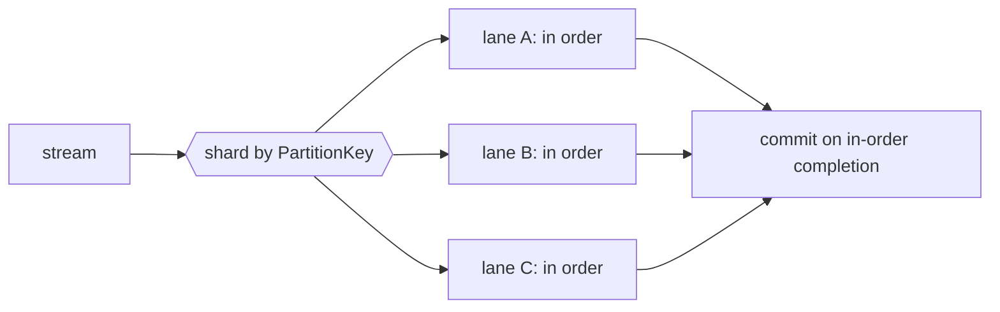

<!-- IMAGE-SLOT: source-ordered-lanes -->

This is the spine of the engine, and the part most consumers get wrong. A
statechart instance must see its events in order, so the default is a
**sharded-by-`PartitionKey()` worker pool with a `MaxInFlight` bound**: N ordered
lanes, a bounded queue per lane, and ack/commit on in-order completion.
**Parallel across keys, strictly in order within a key.**

## Per backend

The bound and the commit mechanism differ by backend; the engine reconciles both
to the same in-order contract.

- **Kafka.** The shard is the partition (the goroutine-per-partition idiom). The
  bound is `PollRecords(n)` plus `PauseFetchPartitions`/`ResumeFetchPartitions`.
  The commit is marked offsets on in-order completion. Rebalance is made safe
  with `BlockRebalanceOnPoll`, a drain on partitions-revoked, and
  `CommitMarkedOffsets`.
- **JetStream.** The shard is `hash(key)`. The bound is `MaxAckPending` plus
  `PullMaxMessages`/`PullThresholdMessages`. The commit is a per-message `Ack`,
  with `InProgress()` to extend the deadline for a long handler.

## The Kafka high-water-mark subtlety

A Kafka offset is a per-partition high-water mark, not a per-message ack. So a
`Nak` on offset 5 blocks 6..N from committing even if they finished: the lane
reconciles to the highest in-order-completed offset and commits only that far.
JetStream acks each message individually and does not have this constraint. The
engine handles the reconciliation for you; the
[reliability page](/crucible/source/reliability/) covers what happens to the
naked message itself.

## Backpressure is honest

`MaxInFlight` is a real bound, not advisory. When lanes are saturated the engine
stops fetching (pause on Kafka, threshold on JetStream) rather than buffering
unboundedly, so a slow handler applies backpressure all the way to the broker
instead of growing memory. Graceful drain on ctx cancel stops fetching, finishes
in-flight work, commits, and closes, with a readiness signal so an orchestrator
knows when the consumer is live.

Ordered-key concurrency is heavily property- and fuzz-tested, and the
[`memsource`](/crucible/source/reliability/#testing-the-loop) harness lets you
assert ordering and ack outcomes deterministically with no broker.
