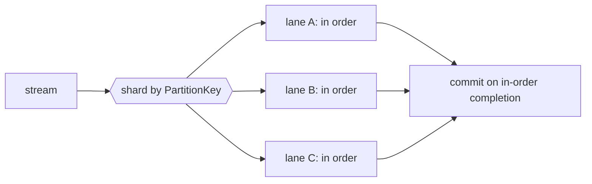

<!-- IMAGE-SLOT: source-ordered-lanes -->

This is the spine of the engine, and the part most consumers get wrong. A
statechart instance must see its events in order, so the default is a
**sharded-by-`PartitionKey()` worker pool with a `MaxInFlight` bound**: N ordered
lanes, a bounded queue per lane, and ack/commit on in-order completion.
**Parallel across keys, strictly in order within a key.**



## Per backend

The bound and the commit mechanism differ by backend; the engine reconciles both
to the same in-order contract.

- **Kafka.** The shard is the partition (the goroutine-per-partition idiom). The
  bound is `PollRecords(n)` plus `PauseFetchPartitions`/`ResumeFetchPartitions`.
  The commit is marked offsets on in-order completion. Rebalance is made safe
  with `BlockRebalanceOnPoll`, a drain on partitions-revoked, and
  `CommitMarkedOffsets`.
- **JetStream.** The shard is `hash(key)`. The bound is `MaxAckPending` plus
  `PullMaxMessages`/`PullThresholdMessages`. The commit is a per-message `Ack`,
  with `InProgress()` to extend the deadline for a long handler.

## The Kafka high-water-mark subtlety

A Kafka offset is a per-partition high-water mark, not a per-message ack. So a
`Nak` on offset 5 blocks 6..N from committing even if they finished: the lane
reconciles to the highest in-order-completed offset and commits only that far.
JetStream acks each message individually and does not have this constraint. The
engine handles the reconciliation for you; the
[reliability page](/crucible/source/reliability/) covers what happens to the
naked message itself.

## Backpressure is honest

`MaxInFlight` is a real bound, not advisory. When lanes are saturated the engine
stops fetching (pause on Kafka, threshold on JetStream) rather than buffering
unboundedly, so a slow handler applies backpressure all the way to the broker
instead of growing memory. Graceful drain on ctx cancel stops fetching, finishes
in-flight work, commits, and closes, with a readiness signal so an orchestrator
knows when the consumer is live.

Ordered-key concurrency is heavily property- and fuzz-tested, and the
[`memsource`](/crucible/source/reliability/#testing-the-loop) harness lets you
assert ordering and ack outcomes deterministically with no broker.

## Batch consume

Some handlers are far cheaper per message in groups: a bulk database upsert, a
single round trip to an index, a vectorized transform. For those, the Hopper has
a batch mode that accumulates messages per ordered lane and hands them to a
`BatchHandler` in one call, then settles each message by its own result.

```go
func(ctx context.Context, ms []source.Message) []source.Result
```

The contract is positional: the result at index `i` settles the message at index
`i`, so a batch can ack some messages, nak others, and dead-letter the rest in a
single pass. A `BatchHandler` must return exactly one result per message; if it
returns too few, the unmatched messages are terminated as poison
(`ErrBatchResultCount`) rather than silently stranded.

Enable it with `WithBatch(size, maxWait)` and drive the run with `RunBatch` (or
`ReceiveBatch`) instead of `Run`:

```go
hp := source.New(
    source.WithConcurrency(8),
    source.WithBatch(100, 50*time.Millisecond),
)
err := hp.RunBatch(ctx, sub, func(ctx context.Context, ms []source.Message) []source.Result {
    res := make([]source.Result, len(ms))
    // ... handle ms as a group, fill res[i] for each ms[i] ...
    return res
})
```

Each lane buffers up to `size` messages, or until `maxWait` elapses since its
first buffered message, then flushes. A partial batch left when the run drains is
flushed before exit, so nothing is lost on shutdown. The `maxWait` timer reads an
injectable clock (`WithBatchClock`) so a time-triggered flush is deterministic in
tests.

### Ordering and backpressure still hold

Batch mode keeps every guarantee of the per-message path. A batch only ever
contains messages from a single ordered lane, delivered in order, so per-key
ordering is preserved within and across batches. A lane never overlaps two
batches: it settles the whole group before accepting more. `WithConcurrency`
bounds how many lanes run their handler at once, and `WithMaxInFlight` still caps
delivered-but-unsettled messages. When both are set, size the in-flight window to
at least the batch size (or supply a positive `maxWait`) so a lane can always
reach a flush.

### Backend batches

When the subscription advertises the `Batched` capability, the engine fetches
whole batches from the backend and regroups them by key into lanes, rather than
accumulating one message at a time. Kafka satisfies it naturally (a `PollRecords`
fetch is already a batch), and JetStream satisfies it through its pull-consumer
fetch. An adapter without the capability is driven one message at a time and the
engine does the accumulation; batch mode works either way, the capability just
skips a layer of per-message hand-off.
