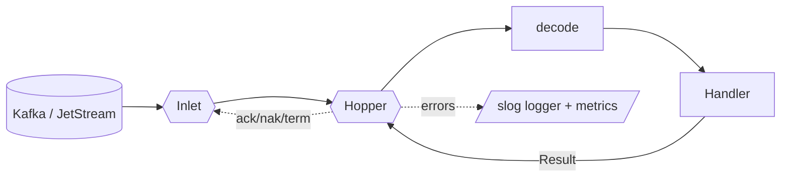

<!-- IMAGE-SLOT: source-overview-intake -->

`crucible/source` is the suite's **ingress seam**: a uniform Go consumer over
Kafka/RedPanda, NATS JetStream, and more. It is the symmetric counterpart to
[`sink`](/crucible/sink/overview/) (egress).

A service declares one binding and the engine runs the loop:

```go
sub, _ := inlet.Subscribe(ctx, source.SubscribeConfig{Topic: "orders"})
sub.Receive(ctx, handler) // runs until ctx cancel; the handler's Result drives the ack
```

The reason it exists, and the thing no other Go ingress library does, is that
**an inbound message drives a Crucible statechart, and the ack is tied to a
durable transition**. The chain `consume → decode → resolve instance →
Fire(event) → persist → ack` is one declared binding, not hand-wired plumbing.

Like every Crucible module, source is built from **thin seams with no-op
defaults and no forced dependencies**. The core imports only the standard
library and [`crucible/telemetry`](/crucible/source/telemetry/); every vendor
SDK lives in its own optional sub-module, built `GOWORK=off`, so you pull in
exactly the backends you use and nothing else.

## The shape of it

An [`Inlet`](/crucible/source/model/) is a per-backend adapter that opens
subscriptions, yields messages, and acks. The [`Hopper`](/crucible/source/model/)
is the core consume engine: it owns the consume loop, per-key ordered
concurrency, bounded in-flight, codec decode, the middleware chain, and the
ack/nak/retry/DLQ decision. A `Handler` is your business logic; it returns a
`Result` the engine acts on.



## What only a state-machine-native ingress can own

These are the differentiators, not table stakes:

- **Exactly-once into the machine.** Everyone offers broker/offset EOS; nobody
  ties "the event was applied as a transition" to the ack. The dedup key is the
  machine's own state version, so a redelivery is provably idempotent with no
  external dedup store.
- **The consume-transition-emit loop as a primitive.** The statechart is the
  processor; emitted effects are transition outputs that can feed a
  [`sink`](/crucible/sink/overview/) Manifold, not a separate output stage.
- **Analyzable consumption.** Because crucible statecharts are already
  analyzable, source can answer at build/load time which inbound event types a
  consumer accepts in which states, and which are unreachable. No other ingress
  library can reason about what consuming a topic actually does.
- **State-aware retry/DLQ.** "Rejected because the event is invalid for the
  current state" (a guard rejection) is a first-class outcome (`Term`, not
  retry), invisible to offset-based libraries.

It also nails the table stakes, or it would not be credible: typed handlers,
classification-aware retry to DLQ, idempotency, per-key ordered concurrency,
backpressure, replay/seek, consumer groups with graceful drain, observability,
and an in-memory test source.

## Where it fits in the suite

The [`state`](/crucible/start/introduction/) kernel decides what should happen
and emits [effects as pure data](/crucible/concepts/effects-and-purity/); it
performs no IO. source feeds that kernel from the outside: an external stream
becomes events, the events drive transitions, and the transition's effects can
fan back out through [`sink`](/crucible/sink/overview/). Neither core imports the
other. They compose through the optional
[state-machine bridge](/crucible/source/with-state/) when you want them
together, and stand completely alone when you do not.

source is the ingress half of a small family of bring-your-own-adapter **IO
seams** (`sink` is egress, `broker` is on the roadmap), each defaulting to a
no-op and forcing nothing third-party on the consumer.

## Next

- [The Inlet and Hopper model](/crucible/source/model/): the vocabulary and the ack model.
- [Ordered concurrency and backpressure](/crucible/source/concurrency/): the spine.
- [Adapters](/crucible/source/adapters/): Kafka and JetStream, plus the per-backend capability table.
- [Reliability middleware](/crucible/source/reliability/): retry, DLQ, idempotency, schema.
- [Codecs and headers](/crucible/source/codecs/): the instance-scoped registry and CloudEvents.
- [Driving a statechart from a stream](/crucible/source/with-state/): the differentiator.
