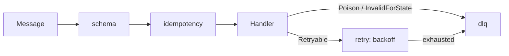

<!-- IMAGE-SLOT: source-reliability-stages -->

Delivery's broker carried these concerns in one monolith. source de-monoliths
them: each is its own opt-in module decorating the `Handler` or the `Hopper`, so
you compose exactly the reliability you need and nothing more.



## retry

`crucible/source/retry` is **classification-aware** backoff. A `Retryable`
result backs off and redelivers; a `Poison` or `InvalidForState` result skips
retry and goes straight to the DLQ. The backoff is config-driven, not hardcoded.
Classification, not the error string, decides the path.

## dlq

`crucible/source/dlq` is a layered dead-letter with a typed reason, the original
headers, the attempt count, and the last error preserved. The defining property:
**the DLQ is itself an `Inlet`**. Draining the parking topic back through the
same handler is first-class replay, with the attempt count reset, not a separate
tool you have to build.

```go
parking := dlq.New(/* backing inlet */)
parking.Subscribe(ctx, cfg) // drain the dead-letters back through your handler
```

## idempotency

`crucible/source/idempotency` is a `Deduper` seam with a no-op default. For a
plain handler it dedups on a key you choose. For the
[state-machine binding](/crucible/source/with-state/), dedup is **transition
idempotency**: the persisted machine carries a state version, so a redelivered
message already applied is a no-op ack with no external dedup store.

## schema

`crucible/source/schema` is an optional validator (proto, Avro, or JSON-Schema)
that runs before the handler. An invalid message is routed to the DLQ as poison
with the schema error attached, so a malformed payload never reaches your
business logic.

## Testing the loop

`crucible/source/memsource` is an in-memory deterministic `Inlet` plus a test
harness. With an injected clock and ID source you assert emitted events, final
machine state, and the exact ack/nak/DLQ outcome, so the
[killer feature](/crucible/source/with-state/) and the
[ordered concurrency](/crucible/source/concurrency/) are unit-testable with zero
infrastructure and no sleeps. Example tests double as godoc and run in CI.
