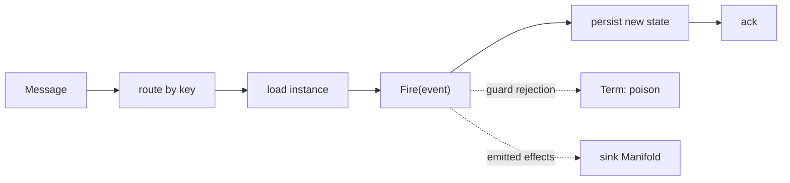

<!-- IMAGE-SLOT: source-statemachine-bridge -->

This is the differentiator, and the reason source exists. source and
[`crucible/state`](/crucible/start/introduction/) compose **without either core
importing the other**. The optional `crucible/source/statemachine` module is the
seam that joins them, depending on both `source` and `state`, mirroring
[`sink/bridge`](/crucible/sink/with-state/) on the egress side.

## A message drives a transition, and the ack waits for it

`Drive` binds the consume loop to a machine. A router resolves the instance ID
and decodes the event from each message; the bridge loads the instance, fires the
event, persists the new state, and **only then** acks.

```go
sub.Receive(ctx, statemachine.Drive(store,
    func(m source.Message) (string, OrderEvent, error) {
        return m.Headers().Get("order-id"), decode(m), nil
    },
))
```

The chain `load → Fire(event) → persist → ack` is one binding. The ack is tied
to the durable transition, so at-least-once delivery never applies an event twice
and never acks an event it failed to persist.



It loads the instance through an injected `Store[K]` interface, so the bridge
does **not** hard-depend on the `durable` runtime; durable can supply an adapter.
Two modes: stateless (a user fire-func, no persistence) and durable (load and
persist).

## Exactly-once into the machine

The persisted machine carries a version or sequence. A redelivered
`(key, eventID)` that was already applied is a **no-op ack**: exactly-once into
the machine, with no external dedup store. The dedup key is the machine's own
state, not a side table you have to operate.

## State-aware rejection is first-class

An event that is invalid for the current state is a guard (or Assay) rejection,
not an infra failure. The bridge classifies it as `Term` (poison) and routes it
to the [DLQ](/crucible/source/reliability/#dlq), distinct from a transient error
that becomes a `Nak` and retries. Offset-based libraries cannot tell these apart;
here it is a typed outcome.

## Consume, transition, emit

A transition's emitted effects can be handed to a
[`sink`](/crucible/sink/overview/) Manifold in the same step, optionally
transactional on Kafka EOS. The statechart is the processor; the consume loop and
the fan-out are the two ends of it.

## Analyzable consumption

Because a crucible statechart is analyzable, the bridge ships a conformance check
that validates the codec's event union is **exhaustive against the statechart's
event alphabet**, and reports inbound events that are unreachable in every state.
You learn at build or load time what consuming a topic can ever do to a machine,
which no opaque-closure consumer can answer.

This is the proof the two libraries compose: a stream decision becomes a
transition, the transition's effects fan back out, and the whole causal chain
correlates through the shared [`crucible/telemetry`](/crucible/source/telemetry/)
provider with no import edge between the kernels.

See also: [Effects and purity](/crucible/concepts/effects-and-purity/) and the
egress mirror, [Fanning state transitions out](/crucible/sink/with-state/).
