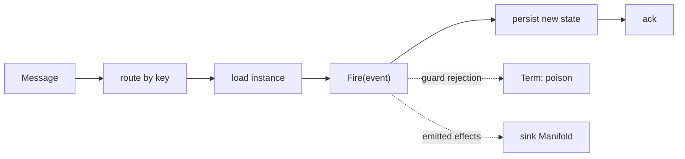

<!-- IMAGE-SLOT: source-statemachine-bridge -->

This is the differentiator, and the reason source exists. source and
[`crucible/state`](/crucible/start/introduction/) compose **without either core
importing the other**. The optional `crucible/source/statemachine` module is the
seam that joins them, depending on both `source` and `state`, mirroring
[`sink/bridge`](/crucible/sink/with-state/) on the egress side.

## A message drives a transition, and the ack waits for it

`Drive` binds the consume loop to a machine. A router resolves the instance ID
and decodes the event from each message; the bridge loads the instance, fires the
event, persists the new state, and **only then** acks.

```go
sub.Receive(ctx, statemachine.Drive(store,
    func(m source.Message) (string, OrderEvent, error) {
        return m.Headers().Get("order-id"), decode(m), nil
    },
))
```

The chain `load → Fire(event) → persist → ack` is one binding. The ack is tied
to the durable transition, so at-least-once delivery never applies an event twice
and never acks an event it failed to persist.



It loads the instance through an injected `Store[K]` interface, so the bridge
does **not** hard-depend on the `durable` runtime; durable can supply an adapter.
Two modes: stateless (a user fire-func, no persistence) and durable (load and
persist).

## Exactly-once into the machine

The persisted machine carries a version or sequence. A redelivered
`(key, eventID)` that was already applied is a **no-op ack**: exactly-once into
the machine, with no external dedup store. The dedup key is the machine's own
state, not a side table you have to operate.

## State-aware rejection is first-class

An event that is invalid for the current state is a guard (or Verify) rejection,
not an infra failure. The bridge classifies it as `Term` (poison) and routes it
to the [DLQ](/crucible/source/reliability/#dlq), distinct from a transient error
that becomes a `Nak` and retries. Offset-based libraries cannot tell these apart;
here it is a typed outcome.

## Consume, transition, emit

A transition's emitted effects can be handed to a
[`sink`](/crucible/sink/overview/) Manifold in the same step. The statechart is
the processor; the consume loop and the fan-out are the two ends of it. The
default bridge (`Drive`) hands effects to a `Sink` and acks after a durable save,
which is at-least-once: an effect can be emitted twice if the process dies after
emit but before the offset commits.

## Exactly-once consume-process-produce (Kafka EOS)

On a `Transactional` subscription (Kafka built with `kafka.WithTransactional`),
`DriveTx` closes that gap. It fires the transition, produces the emitted effects,
persists the new state, and commits the consumed offset all inside one Kafka
transaction, so the emitted records and the ack of the message that produced them
are exactly-once. Effects are produced through a `TxSink`, the transactional
mirror of `Sink`, which turns each effect into records on the open transaction:

```go
txSink := statemachine.TxSinkFunc(func(ctx context.Context, tx source.Tx, eff any) error {
    if oe, ok := eff.(OpenedEffect); ok {
        return tx.Produce(ctx, source.ProducedRecord{Topic: "turnstile.out", Value: encode(oe)})
    }
    return fmt.Errorf("unmapped effect %T", eff) // fail loudly, never drop an output
})

h := statemachine.DriveTx(machine, store, router, transactionalSub, txSink)
// On success h returns source.Manual: the transaction already committed the offset.
```

On a successful transition `DriveTx` returns `source.Manual`, because the
transaction committed the offset itself and the engine must not settle again. A
route failure is still `Term`, a guard rejection still `Reject`, and a redelivered
event already folded into the version is still a `Skip` (a plain offset advance,
not a transaction). An emit failure, a persist failure, or a broker abort (a
rebalance fences the producer) is a `Nak`: nothing committed, and the input is
redelivered.

One subtlety is honest rather than hidden: the durable save runs inside the
transaction, so a broker abort after a successful save can leave the instance
advanced but the offset uncommitted. The redelivery is then deduplicated by the
machine's state version (the same exactly-once-into-the-machine mechanism above),
so it acks as a no-op rather than double-applying. EOS is Kafka only; on
JetStream and other backends the `Transactional` capability is absent and `Drive`
gives the at-least-once path.

## Analyzable consumption

Because a crucible statechart is analyzable, the bridge ships a conformance check
that validates the codec's event union is **exhaustive against the statechart's
event alphabet**, and reports inbound events that are unreachable in every state.
You learn at build or load time what consuming a topic can ever do to a machine,
which no opaque-closure consumer can answer.

This is the proof the two libraries compose: a stream decision becomes a
transition, the transition's effects fan back out, and the whole causal chain
correlates through the shared [`crucible/telemetry`](/crucible/source/telemetry/)
provider with no import edge between the kernels.

See also: [Effects and purity](/crucible/concepts/effects-and-purity/) and the
egress mirror, [Fanning state transitions out](/crucible/sink/with-state/).
