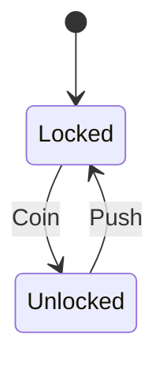

import Order from '../_generated/diagrams/_fooddelivery-order.md';

## Install

```sh
go get github.com/stablekernel/crucible/state
```

The kernel depends only on the Go standard library.

## Your first machine, end to end

A machine is generic over three types you define: **S** (state), **E** (event),
and **C** (context, your domain entity). Here is a toy turnstile, forged and
fired from scratch.

```go
package main

import (
	"context"
	"fmt"

	"github.com/stablekernel/crucible/state"
)

type Gate string  // S
type Signal string // E
type Turnstile struct{ Coins int } // C

const (
	Locked   Gate = "Locked"
	Unlocked Gate = "Unlocked"
)

const (
	Coin Signal = "Coin"
	Push Signal = "Push"
)

func main() {
	// Forge a builder, declare states + transitions, then Quench to freeze
	// the definition into an immutable *Machine. Quench panics on misconfig.
	m := state.Forge[Gate, Signal, Turnstile]("turnstile").
		Initial(Locked).
		Transition(Locked).On(Coin).GoTo(Unlocked).
		Transition(Unlocked).On(Push).GoTo(Locked).
		Quench()

	// Cast an instance around an entity value.
	inst := m.Cast(Turnstile{})

	// Fire advances the instance and returns a FireResult. It performs NO IO.
	// NewState is the next state, Effects is data for the caller to dispatch.
	res := inst.Fire(context.Background(), Coin)
	fmt.Println(res.NewState) // Unlocked

	res = inst.Fire(context.Background(), Push)
	fmt.Println(res.NewState) // Locked
}
```

That toy machine looks like this:



## A real machine

The same primitives scale to hierarchical and parallel statecharts. Here is the
food-delivery order machine that ships as a worked example. Note the nested
`Active` region with parallel fulfillment and watchdog sub-machines, guarded
transitions, and an `after(...)` timer:

<Order/>

Next: read the [foundry vocabulary](/crucible/start/foundry-vocabulary/) to learn
exactly what each lifecycle verb does.
