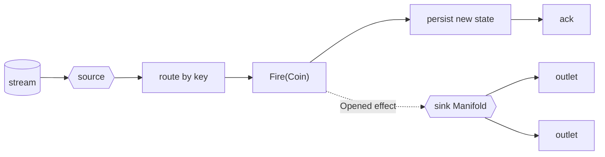

<!-- IMAGE-SLOT: start-ingest-drive-emit (a sky-squid smith taking an ingot in at one side, casting it through a mold, and pouring the result out the other; ember/copper on steel) 16:9 -->

The [getting started](/crucible/start/getting-started/) walkthrough fires a
machine by hand. In a real service the events arrive from a stream and the
transition's effects leave for the outside world. This quickstart wires the three
seams into one loop: [`source`](/crucible/source/overview/) consumes a message,
the message drives a [`state`](/crucible/start/introduction/) transition, and a
[`sink`](/crucible/sink/overview/) emits the effect. None of the three cores
imports another; the [`source/statemachine`](/crucible/source/with-state/) bridge
is the only thing that depends on all of them.

## Install

```sh
go get github.com/stablekernel/crucible/source
go get github.com/stablekernel/crucible/source/statemachine
go get github.com/stablekernel/crucible/sink
go get github.com/stablekernel/crucible/state
```

## The machine

A toy turnstile that emits an `Opened` effect when it unlocks. The effect is pure
data; the machine performs no IO.

```go
type Gate string  // S
type Signal string // E
type Turnstile struct{ Coins int } // C

const (
	Locked   Gate = "Locked"
	Unlocked Gate = "Unlocked"
)

const Coin Signal = "Coin"

type Opened struct{ Coins int }

machine := state.Forge[Gate, Signal, Turnstile]("turnstile").
	// An action returns an effect (pure data) for the transition to emit.
	Action("announceOpen", func(a state.ActionCtx[Turnstile]) (state.Effect, error) {
		return Opened{Coins: a.Entity.Coins}, nil
	}).
	Initial(Locked).
	Transition(Locked).On(Coin).GoTo(Unlocked).Do("announceOpen").
	Quench()
```

## Wire the loop

`statemachine.Drive` binds the consume loop to the machine. A `Router` resolves
each message to an instance key and the event to fire; the bridge loads the
instance through a `Store`, fires the event, hands the emitted effects to the
configured `Sink`, persists the new state, and only then acks. Here the `Sink` is
a [`sink.Manifold`](/crucible/sink/model/) fanning the effect out to its outlets.

```go
// Egress: a Manifold that fans each emitted effect out to its outlets.
manifold := sink.NewManifold(sink.WithOutlets(sink.OutletFunc(
	func(ctx context.Context, payload any) error {
		log.Printf("opened: %+v", payload) // a real outlet writes SQL, Dynamo, a webhook
		return nil
	},
)))

// Durable instance state for the bridge (in-memory for a single process).
store := statemachine.NewMemStore[string, Gate, Signal, Turnstile]()

// Route a message to its instance key and the event to fire.
router := func(m source.Message) (string, Signal, error) {
	return m.Headers().Get("turnstile-id"), Coin, nil
}

handler := statemachine.Drive(machine, store, router,
	statemachine.WithSink(statemachine.SinkFunc(
		func(ctx context.Context, effect any) error {
			manifold.Sink(ctx, effect) // fire-and-forget fan-out
			return nil
		},
	)),
)
```

## Run it

Open a subscription on any [inlet](/crucible/source/adapters/) (Kafka,
JetStream, or the in-memory test source) and hand the bridge handler to
`Receive`. The engine runs the consume loop until the context is cancelled.

```go
sub, err := inlet.Subscribe(ctx, source.SubscribeConfig{Topic: "turnstile"})
if err != nil {
	return err
}
// consume -> route -> Fire(Coin) -> emit Opened -> persist -> ack
return sub.Receive(ctx, handler)
```

That is the whole loop:



The ack is tied to the durable transition, so an at-least-once stream never
applies an event twice and never acks an event it failed to persist. A redelivery
of an already-applied message is a no-op ack, keyed on the machine's own state
version with no external dedup store. An event that is illegal for the current
state is a guard rejection, classified as poison and routed to the
[DLQ](/crucible/source/reliability/#dlq), distinct from a transient error that
retries.

## Next

- [Driving a statechart from a stream](/crucible/source/with-state/): the bridge
  in full, including exactly-once consume-process-produce on Kafka.
- [Fire-and-forget fan-out](/crucible/sink/fan-out/): the Manifold's emit
  semantics, errors, and batching.
- [Effects and purity](/crucible/concepts/effects-and-purity/): why the machine
  emits effects as data instead of performing IO.
