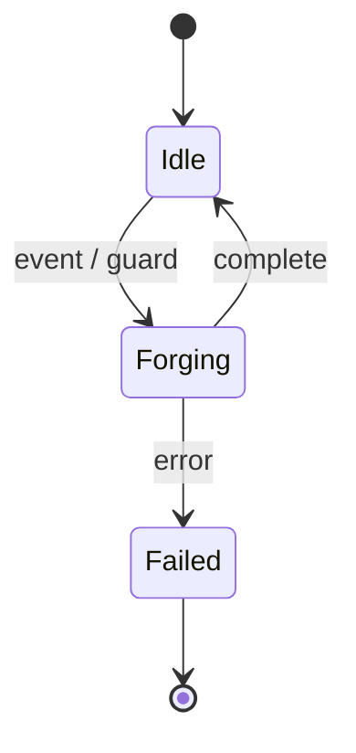

Crucible is a Go suite for forging event-driven services. Its through-line is
simple: **thin seams, no-op defaults, no forced dependencies.**

The modules — statecharts, durable execution, clustering, transport, telemetry —
compose like alloy: take only what you need, bring your own logging and
telemetry, and never inherit a dependency you did not ask for.

This site is under active construction. The pages below are stubs; full content
lands in subsequent releases.

## The lifecycle of an event

Crucible models a service as a statechart that reacts to events. The diagram
below renders client-side via Mermaid to confirm diagram support works:

Next: [Quickstart](/crucible/start/quickstart/).
