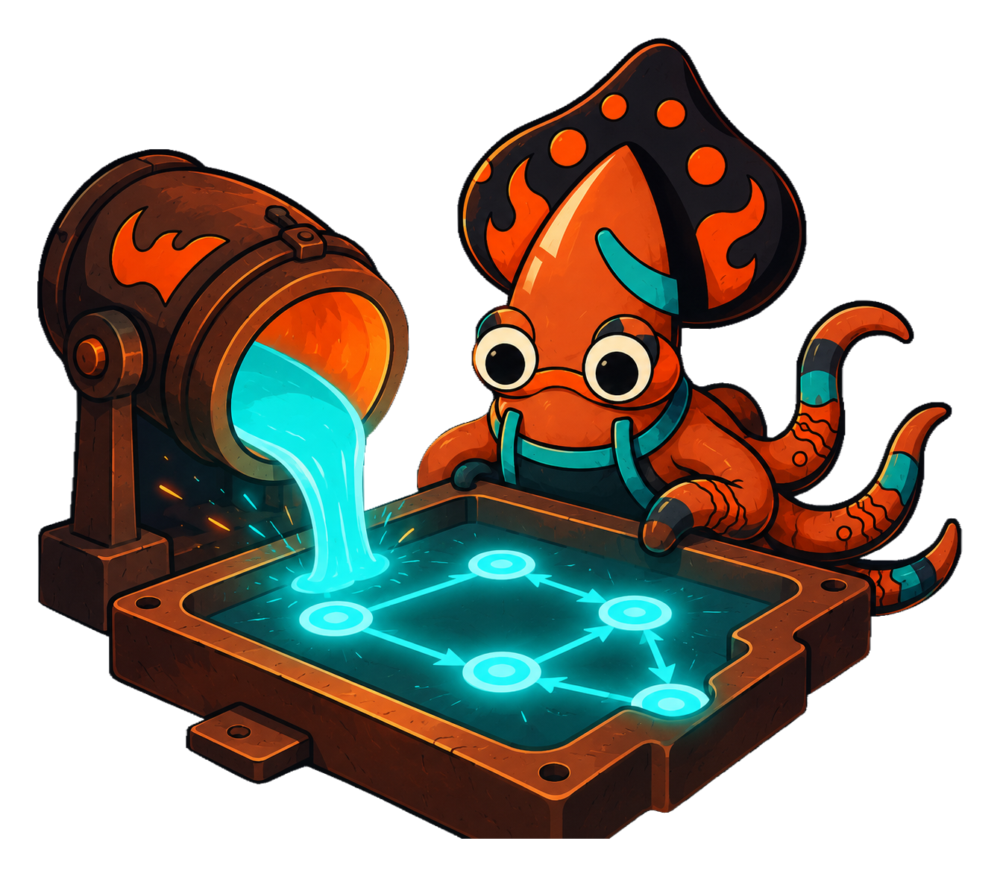

<!-- IMAGE-SLOT: state-kernel-hero: a glowing crucible casting a luminous statechart (nodes and directed arcs) as molten metal pours into a mold, sky-squid mascot peering over the rim; conveys "forge a state machine from abstract definition into a running instance"; 16:9 -->


`crucible/state` is a statechart kernel for Go: an abstract, domain-agnostic
engine for modeling anything that moves through states in response to events:
an order, a payment, a device, a workflow. It is stdlib-only, generic over your
own state, event, and context types, and built so that advancing a machine is a
**pure function**.

## What makes it different

Most statechart libraries braid the *definition* of a machine together with the
*implementation* of its behavior and the *IO* it performs. `crucible/state`
separates all three:

- **The machine is data.** Its canonical form is a serializable IR: states,
  transitions, and behavior referenced by name and params. Nothing executable is
  embedded in the definition.
- **Behavior is bound by name.** A registry maps names to your Go functions
  (guards, actions, assign reducers, services). The same definition can be
  authored in Go today and in a visual editor later; both emit the same IR.
- **Advancing is pure.** `Fire` computes the next state and returns the effects
  to perform as *data*. It does no IO itself. The caller decides what to publish,
  store, or call.

Purity is not an aesthetic. It is what makes a machine **verifiable** and
**durable-ready**. Because state advances deterministically from `(context,
event)`, you can snapshot it, replay it, statically analyze reachable paths, and
verify that an externally-built entity is legally in a given state.

## The shape of the API

The lifecycle reads as foundry verbs: **Forge** a builder, optionally **Temper**
it for diagnostics, **Quench** it into an immutable `*Machine`, **Cast** an
instance around your entity, then **Fire** events at it.

```go
m := state.Forge[Status, Event, Order]("order").
    Initial(Placed).
    Transition(Placed).On(Pay).GoTo(Paid).
    Quench()

inst := m.Cast(Order{ID: "A-1"})
res := inst.Fire(context.Background(), Pay) // res.NewState == Paid; res.Effects is data
```

Next: [Getting started](/crucible/start/getting-started/).
