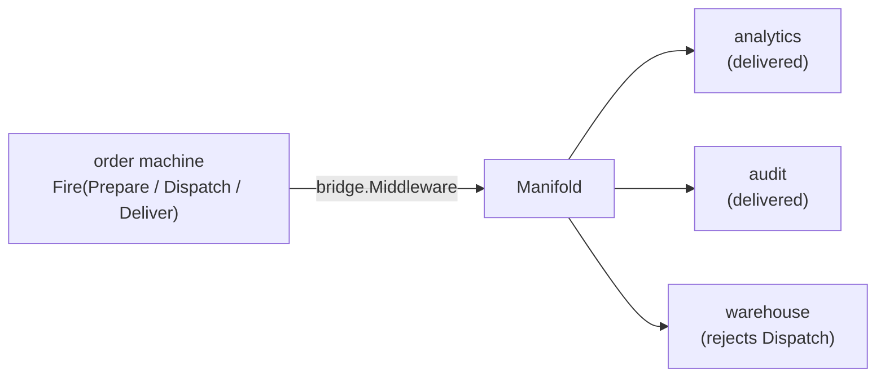

# sinkflow: the flagship intermingling example

A running [`crucible/state`](../../state) machine whose every transition fans out
through a [`crucible/sink`](../../sink) `Manifold` into several destinations, all
observed through one [`crucible/telemetry`](../../telemetry) tracer and meter and
one `log/slog` logger. It is the proof that `state`, `sink`, and `telemetry`
compose through the [`sink/bridge`](../../sink/bridge) seam without any core
importing another.

What the test asserts (`sinkflow_test.go`), all hermetic and deterministic:

- **Delivery**: analytics and audit each receive all three transitions; the
  warehouse, which rejects the dispatch transition, receives the other two. One
  outlet's failure never stops the fan-out.
- **Span nesting**: with one tracer shared by the manifold and the bridge, each
  `sink.Sink` span nests under its `state.transition` span (the context the
  middleware started flows into the emit).
- **Failure visibility**: the induced warehouse failure is observed on both the
  provided `slog` logger (one ERROR record) and the `sink.failed` counter.

The real-emulator integration variant (LocalStack, containers) runs behind the
`integration` build tag in the suite's dedicated CI leg; this hermetic version
is the cross-package contract proof that runs in the default check.

## License

Apache-2.0. See [LICENSE](../../LICENSE) and [NOTICE](../../NOTICE).
